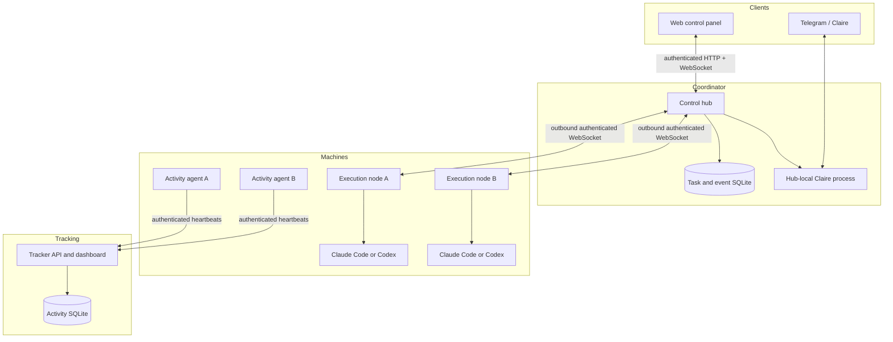

# Stackhour architecture overview

Stackhour combines two related systems in one Rust workspace and binary:

1. a control plane for running Claude Code and Codex on connected machines;
2. an activity tracker that records human and coding-agent work separately.

The modules share project identity and operational tooling, but they use
separate network paths and can be compiled or disabled independently.

## System map

## Control plane responsibilities

The **hub** owns task and run identity, ordered events, routing, connected-node
state, command receipts, the browser session, and Claire's persistent
conversation. It stores accepted work before dispatching it.

An execution **node** owns local workspaces, Git checkouts, terminals, and
Claude or Codex processes. It advertises its capabilities and makes an outbound
connection to the hub. The hub does not need inbound SSH access to run a task;
SSH is used only to install a node when the operator chooses that setup path.

Claire runs on the hub. She may create a worker task on an eligible node,
follow up on an existing run, or stop it. Durable wake receipts let her assess
worker completion after reconnects and restarts before deciding whether to
send a Telegram message.

## Tracker responsibilities

Activity agents observe configured project roots and supported tools, queue
heartbeats while offline, and send them directly to the tracker. They do not
route tracking data through the control hub.

Every heartbeat records an actor. Human attention and parallel agent work use
separate streams, which prevents an agent session from being reported as human
coding time. Project identity is normalized from Git remotes and worktree
metadata so differently named clones can share one project.

## Trust boundaries

- Browser clients and execution nodes use different credentials.
- Node tokens are never delivered to the browser control panel.
- The hub should bind to loopback behind a TLS reverse proxy.
- Nodes initiate their connection, so an execution machine needs no public
  inbound agent port.
- Engine processes run with the permissions of the node user and inside the
  selected local workspace.
- Tracker machine tokens are scoped separately from control-plane credentials.
- Claire decides what worker information is projected to Telegram; raw worker
  and tool output is not forwarded directly.

See [the security model](../../SECURITY.md) for deployment requirements and
[the control plane guide](../control-plane.md#current-limits) for current
recovery and approval limitations.

## Deployment shapes

For a personal setup, the hub and tracker can run on one small private Linux
machine while laptops and development servers connect as nodes and activity
agents. The hub can also be an execution node itself.

For an internet-reachable setup, keep the hub on loopback and place a TLS
reverse proxy in front of it. Nodes then connect with `wss://`. Keep the
tracking dashboard on a private network or behind an authenticated proxy. A
tokenless tracker deliberately leaves reads and writes open for a local-only
setup; configuring a server token closes both.

## Deeper design material

- [Control plane operations](../control-plane.md)
- [Remote agent control plane design study](remote-agent-control-plane.md)
- [Module boundaries and build profiles](../modules.md)
- [Roadmap](../../ROADMAP.md)
