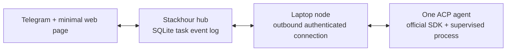
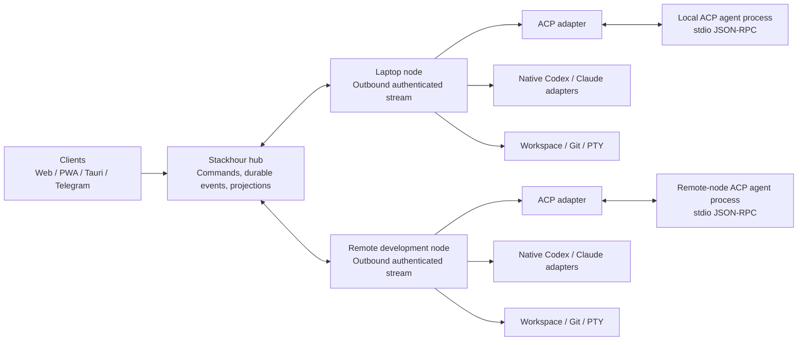
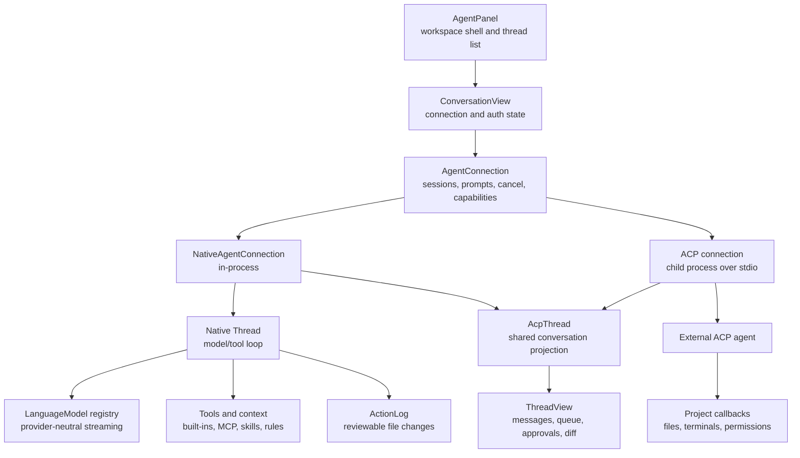

# Remote agent control plane and ACP

- Status: architecture recommendation
- Reviewed: 2026-07-25

This note combines the useful architecture patterns found in T3 Code, a local
Claude Code source snapshot, and Zed's complete agent architecture, including
its native agent and ACP implementation. It extends the
[T3 Code UI and functionality study](t3code-ui-functionality-study.md) with a
concrete recommendation for Stackhour's remote execution and agent protocol
boundaries.

Reviewed source snapshots:

- T3 Code `ece05087a70e94efcd57441337fa1249559362ba`
- Zed `c28cf645f9b3649611afc5d6df58791cf04d62a9`
- local Claude Code source snapshot, including `remote/`,
  `services/api/sessionIngress.ts`, and `utils/teleport/`

## Decision

Stackhour should use three different boundaries for three different jobs:

1. **Stackhour domain and event protocol** between clients, the hub, and
   execution nodes. This is the durable product contract.
2. **ACP inside an execution node** as one way to control a local agent
   process. ACP is an engine adapter, not Stackhour's network or persistence
   protocol.
3. **Native engine adapters only after evidence** that Codex, Claude Code, or
   another engine exposes valuable behavior that ACP cannot represent.

The durable identity hierarchy should be:

```text
Task
  Run
    ProviderSession
```

- A `Task` is the user-visible, durable unit of work shared by Telegram, web,
  PWA, desktop, and mobile clients.
- A `Run` is one execution attempt on one node, checkout, engine, model, and
  access policy.
- A `ProviderSession` is the ACP, Codex, Claude, or other runtime identity used
  to continue a provider conversation.

A provider process can crash, reconnect, upgrade, or be replaced without
changing the identity or history of the task.

### Build now versus preserve for later

The complete architecture in this document is a reference end state. The first
implementation should prove one end-to-end loop:



Build now:

- `Task`, `Run`, `Event`, `Approval`, and stable node identity;
- one append-only SQLite event table with one hub-assigned sequence;
- UUID idempotency for commands and node-originated events;
- reconnect and `after_sequence` catch-up;
- one explicitly configured ACP agent;
- streaming assistant messages, durable approvals, and interrupt;
- approval resolution from either Telegram or the web page.

Preserve as later architecture, but do not implement yet:

- native Codex and Claude adapters;
- a native Stackhour model/tool loop;
- model-provider, tool, context, and review frameworks;
- terminals, worktrees, checkpoint restore, and hunk-level diff review;
- ACP registry installation, subagents, sibling tasks, and offline PWA.

This keeps the important boundaries without requiring the entire Zed agent
stack before Stackhour's core remote-control claim is validated.

## Target topology



Every node initiates its connection to the hub. The laptop therefore needs no
public inbound port and can disappear or sleep without corrupting task state.
The hub queues work with explicit expiry and cancellation semantics.

The ACP process runs on the node that owns the checkout. ACP's filesystem and
terminal callbacks are inherently workspace-local, so routing raw ACP between
the hub and an arbitrary client would put the security boundary in the wrong
place.

## What each reference contributes

| Reference | Adopt | Adapt | Do not copy |
| --- | --- | --- | --- |
| T3 Code | Durable commands, ordered events, projections, receipts, environment boundary, shared client runtime | Put a Stackhour hub in front of multiple outbound-connected nodes | Direct client-to-every-environment topology |
| Claude Code | Separate command ingress and live event stream, stable message IDs, optimistic append chain, reconnect cursors, permission control messages | Persist approvals and normalize SDK events into Stackhour events | Provider-shaped SDK stream as the product domain; memory-only approvals |
| Zed agent stack | One UI-facing connection contract for native and ACP agents, capability-driven UI, provider-neutral model streaming, layered tool policy, lazy skills, subagent separation, and reviewable diffs | Keep the same boundaries but make Stackhour's hub—not an in-memory thread—the durable authority | Zed's GPUI entities, editor-wide remote RPC surface, Zed-specific extensions, or GPL source |

## T3 Code findings

T3 Code has the strongest model for Stackhour's durable product state:

```text
command
  -> invariant and authorization checks
  -> append durable event
  -> update projection
  -> publish ordered change
```

Important properties to retain:

- command IDs and durable receipts make retries idempotent;
- subscriptions accept an `afterSequence` cursor;
- a subscriber catches up from a snapshot or event range before becoming
  live;
- the client has one connection/retry owner instead of independent retries in
  each feature;
- provider output is translated into a provider-neutral task timeline;
- an environment owns its projects, files, Git state, terminals, provider
  processes, and credentials.

The last item maps well to a Stackhour node. The difference is topology: T3
clients can connect directly to environments, while Stackhour needs one
durable hub so Telegram, PWA, Tauri, and multiple nodes observe the same task
and approval state.

T3's SQLite event store, projections, and command receipts are relevant
because Stackhour already uses `rusqlite`. The proposed control-plane tables
are an extension of the existing storage stack, not a requirement to add a
new database technology.

## Claude Code findings

Claude Code's remote implementation is a useful reference for session
transport:

- user commands enter over an HTTP-style append operation;
- a WebSocket carries SDK events and control messages;
- permission requests, responses, cancellation, and interrupt are explicit
  protocol messages;
- stable UUIDs allow optimistic user messages to be reconciled with echoed
  server events;
- session ingress serializes writes per session;
- each append includes the previous UUID, forming an optimistic chain;
- an uncertain write can recover from a conflict instead of blindly
  duplicating the command;
- history uses opaque cursor pagination, while the live stream resumes from a
  last-seen event ID.

The patterns are useful, but the state ownership is too provider-specific for
Stackhour:

- the pending permission map is process-memory state and is cleared on
  disconnect;
- reconnect attempts are capped;
- the event stream exposes Claude SDK concepts rather than stable Stackhour
  domain events;
- the central service and its retention behavior are not under Stackhour's
  control.

Stackhour should therefore copy the mechanics, not the data model. Approval
requests must become durable hub entities before they are shown in Telegram
or a graphical client.

## Zed ACP findings

### ACP's roles

In Zed, the editor is the ACP **client** and the external coding agent is the
ACP **agent**. Zed launches the agent as a child process and exchanges
line-delimited JSON-RPC over the child's stdin and stdout. Stderr is captured
separately for diagnostics. Dropping the connection kills the child.

Initialization sends protocol version V1, client implementation metadata, and
client capabilities. Zed then validates the returned protocol version and
stores:

- agent implementation and version;
- agent capabilities;
- authentication methods;
- supported session operations;
- prompt capabilities;
- modes and configuration options.

This negotiation is important. ACP agents do not all implement the same
surface. Load, resume, close, list, delete, extra directories, modes, model
selection, configuration options, authentication, and logout must be exposed
only when the connected agent advertises them.

Zed also notes a current limitation in the reviewed source: ACP prompt
capabilities are connection-wide and cannot currently change per session.
Stackhour should store the negotiated capability snapshot on each run, but
must be able to refresh it when a new connection is established.

### Session lifecycle

Zed's ACP connection supports:

- `session/new`;
- optional `session/load`;
- optional `session/resume`;
- optional `session/close`;
- optional session list and delete;
- prompt as a request/response operation;
- streamed `session/update` notifications during the prompt;
- cancellation as a notification;
- session modes and typed configuration options;
- agent, environment-variable, and terminal-based authentication.

For session loading, Zed registers the pending session before sending the load
request. Historical replay notifications therefore have a target even before
the load RPC completes. Concurrent opens of the same session share the
in-flight operation and use reference counts.

Stackhour needs the same ordering rule. It should create the local
`ProviderSession` projection before starting new/load/resume, then accept
provider events. The hub event log remains the source of truth even when the
provider cannot load or resume its own session.

### Agent-to-client callbacks

The reviewed Zed client advertises these capabilities to agents:

- text file read and write;
- terminal creation, output, exit waiting, kill, and release;
- permission requests;
- form and URL elicitations;
- terminal authentication;
- boolean session configuration options.

The callbacks are handled by Zed's project and terminal layers, not by the
agent process directly. Incoming protocol work is forwarded from the
thread-safe JSON-RPC handler to the GPUI foreground thread through a queue.
This is a useful separation between transport parsing and state mutation.

Stackhour should use an equivalent separation:

```text
ACP transport
  -> validated adapter message
  -> node runtime command
  -> workspace / terminal / approval policy
  -> ACP response
  -> normalized Stackhour event
```

ACP capability advertisement is not authorization. Advertising file or
terminal support only means the node can service such a request. The node
must still apply the run's access policy, allowed checkout roots, command
policy, environment filtering, and any required user approval.

### Session updates

Zed projects `session/update` notifications into a thread model with:

- user message chunks;
- assistant message chunks;
- agent thought chunks;
- tool calls and tool-call updates;
- plans;
- title and session metadata;
- available commands;
- current mode and configuration changes;
- token usage and cost.

It optimistically inserts a user message and then suppresses a matching echoed
chunk from the agent. It also turns prompt stop reasons such as cancellation,
refusal, and maximum-token termination into explicit UI state.

These are valuable normalization examples, but Stackhour should normalize into
its own durable vocabulary rather than persisting Zed's `AcpThread` entries.

### Discovery and installation

Zed supports both custom commands and an ACP registry. Registry entries can
resolve to npm packages or platform archives. The command builder combines
the project environment, registry environment, user settings, and per-launch
overrides. Zed includes known registry IDs for Gemini, Claude ACP, Codex ACP,
and Cursor, while retaining a generic custom-agent path.

For remote projects, Zed asks the workspace-owning side to resolve the agent
command and environment. This reinforces the Stackhour node boundary:
installation, executable discovery, credentials, and process launch belong to
the execution node.

Stackhour should begin with explicit local agent definitions and add registry
installation later. Automatic downloads are a supply-chain feature and need
version pinning, checksums, provenance, update policy, and an auditable user
decision.

### Licensing boundary

The reviewed Zed `acp_thread` and `agent_servers` crates are licensed
GPL-3.0-or-later, while Stackhour is MIT licensed. Do not copy their
implementation into Stackhour.

Use Zed as an architecture and behavior reference, then implement an
independent ACP client against the official protocol specification and a
dependency whose license has been reviewed for Stackhour. Zed-specific
metadata extensions such as its terminal-output fields should not become
required Stackhour behavior.

The official ACP SDK is the preferred protocol dependency. Pin its version,
verify its Apache-2.0 license at that version, and preserve required notices.
Independent implementation here means Stackhour owns process supervision,
policy, and event normalization; it does not mean rewriting protocol types and
JSON-RPC framing already supplied by the SDK.

## Zed overall agent architecture

### Layer map

Zed's most useful architectural decision is that the native in-process agent
and external ACP agents meet the UI through the same `AgentConnection`
contract:



The native engine does not run ACP internally. `NativeAgentServer` creates an
in-process `NativeAgent`, while the ACP path supervises an external process.
Both implementations adapt their events into the same conversation
projection. This preserves native capabilities without maintaining two user
interfaces.

Stackhour should copy this shape with its own names and domain:

```text
EngineConnection
  NativeEngineConnection
  AcpEngineConnection
  CodexEngineConnection
  ClaudeEngineConnection

All produce Stackhour RunEvents.
```

`EngineConnection` should be an operational adapter contract, not the durable
domain. A provider session can be reconstructed or replaced; a Stackhour
`Task`, `Run`, approval, question, and accepted artifact must survive it.

### Native turn engine

Zed's native `Thread` owns the model/tool loop. For each model round it:

1. compacts context when needed;
2. re-reads the selected model and enabled tool profile;
3. creates a provider-neutral completion request;
4. streams text, thinking, usage, and tool calls;
5. starts tools as their inputs become available;
6. collects parallel tool results;
7. appends structured results and continues until a terminal stop reason.

Re-reading model and tool settings between rounds lets a user change the
profile or model during a turn. Tools can execute concurrently, while
cancellation, refusal, token limits, retries, and compaction remain explicit
thread states.

The language-model layer is independent of the agent loop. Providers implement
one model interface and emit normalized events such as text, reasoning, tool
use, usage, stop, and compaction. The registry separately selects models for
the main agent, summaries, compaction, and inline assistance.

For Stackhour this implies two distinct extension points:

- an **engine** controls session and agent-loop behavior;
- a **model provider** performs inference.

A native Stackhour engine should be able to change model provider without
changing the task or engine identity. Conversely, an ACP engine may own its
model selection internally.

### Tools, authorization, and sandboxing

Zed's native tools expose JSON-schema input, streaming input updates, a run
operation, and a replay operation. Replay rebuilds UI state after loading a
thread without re-running side effects. Built-ins cover files, search,
editing, diagnostics, terminal execution, navigation, web access, subagents,
and sibling threads. MCP/context-server tools are merged into the active tool
set and conflicting names are qualified.

Tool availability, authorization, and sandbox access are separate layers:

- a profile determines which tools the model sees;
- immutable destructive-command rules deny known dangerous operations;
- configured deny, confirm, and allow patterns apply in that order;
- per-tool and global defaults apply only after the stronger rules;
- workspace trust can remove tools before inference;
- canonical path checks prevent symlink and worktree escape;
- sandbox grants independently control network, filesystem writes, and
  unsandboxed execution;
- grants have explicit once, thread, or persistent scope.

Command policy parses chained subcommands instead of testing the raw string as
one unit. A permitted prefix therefore cannot hide a later destructive
command. Zed also checks authorization again immediately before execution,
which reduces time-of-check/time-of-use problems.

Stackhour should put this policy engine below every runtime adapter. ACP
capabilities and a model's requested tool call are descriptions of possible
operations, never authorization. The hub should persist the approval and its
scope; the execution node should enforce the final path, process, environment,
network, and sandbox decision.

### Context, rules, skills, and MCP

Zed builds project context from worktrees, operating-system and shell
information, project rules, and a compact skill catalog. It recognizes common
agent instruction files, combines personal and project instructions, and
refreshes context when project state changes.

Skills use progressive disclosure:

- the system prompt gets only skill name, description, and location;
- the model loads a skill body on demand through a tool;
- global and project-local skills are distinct;
- project skills require a trusted worktree;
- project definitions override global definitions with the same name;
- skill content is escaped before prompt insertion;
- edits to skills and other persistent instruction paths require stronger
  approval.

The project context is not replaced when a refresh is byte-for-byte
equivalent, which helps preserve model prompt-cache prefixes.

This is a good pattern for Stackhour. The execution node should resolve
filesystem-backed rules, skills, and MCP servers near the workspace. The hub
should store provenance, hashes, activation events, and policy metadata, while
avoiding unnecessary uploads of private local content.

### Child agents versus sibling tasks

Zed deliberately distinguishes two kinds of delegation:

- a **subagent** is a child of the current agent turn, receives a self-contained
  prompt, and returns a result to its parent;
- a **sibling thread** is an independent user-visible conversation, optionally
  created with its own Git worktree, and does not return a tool result to the
  original thread.

Native subagents share project context and tools, have their own session and
action log, and can roll their changes into the parent's review surface. The
reviewed implementation limits subagent nesting to one level. Deleting a root
thread also removes persisted descendants.

Stackhour should represent these differently:

- child `Run` or `Subtask`: causally linked to a parent run and expected to
  produce a result;
- sibling `Task`: independent durable work that appears in every client;
- checkout/worktree selection: an execution policy attached to a run, not an
  agent-protocol concept.

### Conversation state and command queue

Zed separates the provider session ID from a stable thread metadata ID. Draft
prompts can therefore exist before a provider session is created. User title
overrides are also stored separately so a later agent-generated title cannot
replace them.

While a response is streaming, follow-up messages can be queued with distinct
semantics:

- wait until the current response completes;
- steer at the next turn boundary;
- cancel and send immediately.

Permissions and elicitations are presented as ordered queues across the
conversation, and capabilities drive whether model, mode, authentication,
configuration, load, and resume controls appear.

In Zed much of this is an in-memory UI projection backed by provider-specific
history. Stackhour needs queue operations, drafts, approvals, questions,
interrupts, and title overrides as durable commands/events so Telegram, web,
PWA, and desktop clients cannot disagree.

### File-change review

Zed's `ActionLog` tracks buffers read, created, edited, and deleted by an agent.
It maintains a diff base and unreviewed patch independently of the current
buffer. Users can accept or reject individual ranges or all changes, and can
undo the most recent rejection. Created files, overwritten files, deleted
files, external user edits, and stale reads receive different handling.

Linked action logs let a subagent keep an individual diff while contributing
its reads and writes to the parent review experience. File read times and
buffer versions help detect external modification.

For Stackhour, `tool.completed` must not imply `change.accepted`. Store these
as separate concepts:

```text
file_change.proposed
file_change.updated
file_change.accepted
file_change.rejected
file_change.rejection_undone
```

Large patches can remain artifact-backed, but the decision, actor, base
revision, affected paths, and resulting Git/checkpoint identity should be
durable. Rejection must verify the base before mutating a file that may have
changed on another client or outside the agent.

### Local and remote projects

Zed's agent UI stays on the client, while its `Project` abstraction can proxy
buffers, Git, language servers, tasks, settings, and terminals to the machine
that owns a remote workspace. The native agent remains in process with the UI
but invokes tools through that project abstraction. External agent commands
are resolved and launched on the workspace-owning side.

This validates locality—tools and agent processes should execute beside the
checkout—but Zed's editor-wide remote object graph is broader than Stackhour
needs. Stackhour should expose a narrow node protocol for task execution,
artifacts, terminals, Git, approvals, and capability discovery. The durable
hub should not attempt to mirror every editor object.

### Persistence and limitations

Zed uses two persistence layers:

- native thread content is compressed JSON in SQLite, including messages,
  model, profile, usage, draft, UI position, subagent state, and sandbox data;
- lightweight metadata tracks native and ACP threads for the common sidebar,
  including stable thread ID, provider session ID, agent, title, timestamps,
  workspace paths, remote connection, and archive state.

External ACP agents remain responsible for replaying provider history when
they support load/resume. This is appropriate for a desktop editor, but not
enough for Stackhour's multi-client remote control plane. Stackhour's hub must
own a canonical, provider-neutral event history; provider history is only a
continuation and recovery aid.

### Stackhour recommendation from Zed

Adopt:

- one connection interface and one timeline across native and ACP agents;
- separate engine and model-provider abstractions;
- capability-driven controls;
- layered profiles, approvals, workspace trust, and sandbox policy;
- progressive skill/context loading;
- explicit child-subtask versus sibling-task semantics;
- reviewable changes distinct from tool completion;
- stable Stackhour IDs distinct from provider session IDs.

Do not adopt:

- ACP types as the product database schema;
- in-memory approval or follow-up queues;
- the full editor remote-object graph;
- provider-owned history as the only copy of a task;
- GPUI entities or GPL implementation code.

The practical sequence remains ACP first because it connects multiple existing
agents quickly. Build the runtime boundary so a native Stackhour engine can be
added later without changing the UI, node protocol, task history, approval
model, or review workflow.

## ACP mapping into Stackhour

ACP messages should be normalized at the node boundary:

| ACP concept | Stackhour representation |
| --- | --- |
| Connection initialization | `engine.connected` plus negotiated capability snapshot |
| Agent process exit or transport failure | `engine.disconnected`; fail or pause the active run according to restart policy |
| `session/new`, `load`, or `resume` | `provider_session.opened` linked to a `Run` |
| Prompt request | node command caused by `run.start` or `message.send` |
| User message chunk | reconcile with the durable `message.user` command using a client message ID |
| Agent message chunk | `message.assistant.delta` |
| Prompt response | `message.assistant.completed` and a terminal run state derived from stop reason |
| Agent thought chunk | optional `activity.updated`, subject to privacy and retention policy |
| Tool call/update | `activity.started`, `activity.updated`, or `activity.completed` |
| Plan update | `plan.updated` |
| Permission request | durable `approval.requested`; response only after `approval.resolved` |
| Elicitation | durable `question.requested` and `question.answered` |
| Usage/cost update | `usage.updated` on the run |
| File callback | node-local capability operation plus an audit event; content is not copied into the main event log |
| Terminal callback | node-local PTY plus resumable terminal metadata and chunked output |
| Cancel notification | node effect caused by durable `run.interrupt` |

Keep raw ACP packets in an optional, versioned diagnostic stream with bounded
retention. UI projections and automation must not depend on raw packets.

## Durable data model

For the first slice, commands and events need:

- `command_id`;
- `event_id`;
- one hub-assigned `sequence`;
- `task_id`;
- `run_id`, when the event belongs to an execution attempt;
- `provider_session_id`, when known;
- `node_id`;
- `protocol_version`;
- `occurred_at` and hub receipt time.

The initial hub should persist:

- tasks and runs;
- the ordered task event log;
- idempotent command receipts;
- approvals, including expiry and resolution actor;
- node identity, capability snapshots, and last-seen cursor;
- provider session references and bounded diagnostic data.

SQLite queries can project the first UI directly. Add dedicated projection
tables only after measured query or product requirements justify them.
`causation_id`, `correlation_id`, node-local sequences, artifact storage, and
separate high-volume streams remain compatible future extensions, not initial
schema requirements.

## Reconnect and idempotency rules

1. A client sends every mutation with a stable `command_id`.
2. The hub stores the command receipt and resulting event sequence
   atomically.
3. A node-originated event has a stable UUID; the hub deduplicates it before
   assigning the one global sequence.
4. A node acknowledges commands it has accepted, and retries use the same
   UUID rather than creating a new effect.
5. Clients subscribe with `after_sequence`, catch up, and then switch to live
   delivery without a gap.
6. Optimistic user messages carry a stable client message ID so provider
   echoes can be reconciled.
7. Reconnection does not have a small fixed retry ceiling. Backoff is bounded,
   jittered, and continues until the user disables the node or credentials
   require intervention.

ACP itself does not provide this distributed durability. The node adapter must
translate its local, process-scoped stream into the rules above.

Introduce a separate node sequence only if offline node spooling or multiple
hub writers demonstrate a real ordering problem that UUID deduplication cannot
solve.

## Approval and security model

An ACP permission request must never wait only in an in-memory callback.

The node should:

1. receive the ACP permission request;
2. persist/send `approval.requested` to the hub with the tool-call ID, options,
   requested scope, node, checkout, command or path summary, and expiry;
3. keep the ACP request pending while any authorized client may decide it;
4. receive the durable `approval.resolved` command;
5. verify that the decision still applies to the same run and request;
6. answer the ACP request;
7. emit the resulting tool status.

If the node disconnects, the approval remains visible but becomes
non-actionable until the node reconnects or the request expires. A late or
duplicate decision must be idempotent.

Separate these permissions:

- read workspace files;
- write workspace files;
- execute commands;
- use the network;
- read terminal output;
- send terminal input;
- access secrets or credential brokers;
- operate outside the configured checkout roots.

An `allow always` choice must have an explicit scope such as this run, this
task, this checkout, this node, or a named policy. It must not silently become
unbounded machine access.

For the first vertical slice, expose only the permission choices the selected
ACP agent actually requests. Default to one-request allow or deny. Add
run/checkout/node persistence scopes and a richer policy matrix after the
approval loop is proven and audited.

## Initial code boundaries

```text
crates/
  stackhour-domain
    task, run, event, approval, IDs, SQLite persistence

  stackhour-hub
    client and Telegram API
    ordered subscriptions and command receipts
    node authentication and routing

  stackhour-node
    outbound hub connection and run supervision
    ACP adapter module using the official Apache-2.0 SDK
    one configured workspace and agent process
```

Keep protocol types in `stackhour-domain` and ACP inside `stackhour-node` until
another consumer or adapter proves a real extraction boundary. Keep Telegram
inside the hub while it is one small client projection.

The existing config-driven `stackhour-bridge` engine runner can remain during
the migration. It is a useful compatibility adapter, but its current
completion-oriented `RunResult` and filesystem queue are not rich enough to
become the shared interactive task protocol.

Possible future seams include `protocol`, `runtime`, `models`, `context`,
`tools`, `acp`, `terminal`, `git`, and `review`. These are logical boundaries
in the target architecture, not crates to create preemptively. Split them when
they have multiple consumers, an independent lifecycle, or dependencies worth
isolating.

## Implementation order

### 1. Prove one ACP task end to end

- Add the five initial entities and the append-only SQLite event table.
- Assign one sequence at the hub and deduplicate commands/events by UUID.
- Project the current Telegram bridge through the task/run model.
- Add the authenticated outbound laptop-node connection.
- Use the official ACP SDK around one explicitly configured agent.
- Stream user and assistant messages and support interrupt.

### 2. Prove remote approval

- Persist `approval.requested` before presenting it.
- Resolve the same approval from Telegram or the minimal web page.
- Test duplicate decisions, expiry, interruption, and disconnect while an
  approval is pending.

### 3. Harden the hub and add the shared web/PWA

- Define client and node authentication, credential rotation, backup, restore
  testing, upgrade, and recovery before relying on the hub as the only copy.
- Add task navigation, reconnect diagnostics, responsive layout, and PWA
  installation.
- Add the remote development node using the same node binary.

### 4. Add specialist capabilities when the product needs them

- Add project/checkout identity, attachments, artifacts, terminals, Git,
  worktrees, and diff review one feature at a time.
- Split crates only as proven boundaries emerge.
- Add discovery and installation only with pinning, checksums, provenance,
  visible updates, and rollback.

### 5. Add richer engines only with measured evidence

- Measure ACP event fidelity, recovery, tool semantics, and missing features.
- Add a native Codex or Claude adapter only for a material demonstrated gap.
- Normalize all adapters into the same Stackhour task timeline.
- Give a native Stackhour engine a separate RFC; do not create model, context,
  tool, or subagent frameworks before that RFC is approved.

## Acceptance tests

The first vertical slice is complete when:

- a task started in Telegram opens with the same history on the web;
- the laptop can sleep during streaming, reconnect, and recover without
  duplicated messages or events;
- an ACP permission requested on the laptop is durably visible and resolvable
  from Telegram or web;
- an approval survives disconnection and can resolve or expire safely after
  reconnect;
- retrying the same client command produces only one durable effect;
- killing an ACP child process exposes an actionable run state;
- cancelling a prompt from one client reflects the final run state in all
  clients.

Later architecture remains accountable to these tests when its features are
implemented:

- run the same task on either the laptop or remote development node;
- load or resume only when the agent advertises the capability;
- reject a file path outside the run's allowed checkout roots;
- queue a follow-up from one client and steer or interrupt it from another
  without duplicating the message;
- run a child subtask and preserve both its own result and its causal link to
  the parent run;
- propose agent file changes, accept one hunk, reject another from a different
  client, and detect a stale base safely;
- reload a task timeline without replaying tool side effects;
- upgrade hub and node independently within the supported protocol window.

## Reference source index

T3 Code:

- [Architecture overview](https://github.com/pingdotgg/t3code/blob/ece05087a70e94efcd57441337fa1249559362ba/docs/architecture/overview.md)
- [Remote architecture](https://github.com/pingdotgg/t3code/blob/ece05087a70e94efcd57441337fa1249559362ba/docs/architecture/remote.md)
- [Connection runtime](https://github.com/pingdotgg/t3code/blob/ece05087a70e94efcd57441337fa1249559362ba/docs/architecture/connection-runtime.md)
- [Orchestration contracts](https://github.com/pingdotgg/t3code/blob/ece05087a70e94efcd57441337fa1249559362ba/packages/contracts/src/orchestration.ts)
- [Orchestration engine](https://github.com/pingdotgg/t3code/blob/ece05087a70e94efcd57441337fa1249559362ba/apps/server/src/orchestration/Layers/OrchestrationEngine.ts)

Claude Code local source snapshot:

- `remote/RemoteSessionManager.ts`
- `remote/SessionsWebSocket.ts`
- `remote/sdkMessageAdapter.ts`
- `remote/remotePermissionBridge.ts`
- `services/api/sessionIngress.ts`
- `utils/teleport/api.ts`

Zed:

- [Agent UI entry point](https://github.com/zed-industries/zed/blob/c28cf645f9b3649611afc5d6df58791cf04d62a9/crates/agent_ui/src/agent_panel.rs)
- [Shared conversation connection store](https://github.com/zed-industries/zed/blob/c28cf645f9b3649611afc5d6df58791cf04d62a9/crates/agent_ui/src/agent_connection_store.rs)
- [Native agent server adapter](https://github.com/zed-industries/zed/blob/c28cf645f9b3649611afc5d6df58791cf04d62a9/crates/agent/src/native_agent_server.rs)
- [Native agent connection and session projection](https://github.com/zed-industries/zed/blob/c28cf645f9b3649611afc5d6df58791cf04d62a9/crates/agent/src/agent.rs)
- [Native thread and tool loop](https://github.com/zed-industries/zed/blob/c28cf645f9b3649611afc5d6df58791cf04d62a9/crates/agent/src/thread.rs)
- [Language model interface](https://github.com/zed-industries/zed/blob/c28cf645f9b3649611afc5d6df58791cf04d62a9/crates/language_model/src/language_model.rs)
- [Tool interface and turn loop](https://github.com/zed-industries/zed/blob/c28cf645f9b3649611afc5d6df58791cf04d62a9/crates/agent/src/thread.rs)
- [Configured tool permissions](https://github.com/zed-industries/zed/blob/c28cf645f9b3649611afc5d6df58791cf04d62a9/crates/agent_settings/src/agent_settings.rs)
- [Runtime tool authorization](https://github.com/zed-industries/zed/blob/c28cf645f9b3649611afc5d6df58791cf04d62a9/crates/agent/src/tool_permissions.rs)
- [Agent skills architecture](https://github.com/zed-industries/zed/blob/c28cf645f9b3649611afc5d6df58791cf04d62a9/crates/agent_skills/README.md)
- [Project context and instruction discovery](https://github.com/zed-industries/zed/blob/c28cf645f9b3649611afc5d6df58791cf04d62a9/crates/prompt_store/src/prompts.rs)
- [Agent action log and diff review](https://github.com/zed-industries/zed/blob/c28cf645f9b3649611afc5d6df58791cf04d62a9/crates/action_log/src/action_log.rs)
- [Native thread persistence](https://github.com/zed-industries/zed/blob/c28cf645f9b3649611afc5d6df58791cf04d62a9/crates/agent/src/db.rs)
- [Cross-agent thread metadata](https://github.com/zed-industries/zed/blob/c28cf645f9b3649611afc5d6df58791cf04d62a9/crates/agent_ui/src/thread_metadata_store.rs)
- [Remote project construction](https://github.com/zed-industries/zed/blob/c28cf645f9b3649611afc5d6df58791cf04d62a9/crates/project/src/project.rs)
- [ACP connection and process transport](https://github.com/zed-industries/zed/blob/c28cf645f9b3649611afc5d6df58791cf04d62a9/crates/agent_servers/src/acp.rs)
- [ACP connection abstraction](https://github.com/zed-industries/zed/blob/c28cf645f9b3649611afc5d6df58791cf04d62a9/crates/acp_thread/src/connection.rs)
- [ACP thread projection](https://github.com/zed-industries/zed/blob/c28cf645f9b3649611afc5d6df58791cf04d62a9/crates/acp_thread/src/acp_thread.rs)
- [Custom and registry agent integration](https://github.com/zed-industries/zed/blob/c28cf645f9b3649611afc5d6df58791cf04d62a9/crates/agent_servers/src/custom.rs)
- [Agent discovery and remote command resolution](https://github.com/zed-industries/zed/blob/c28cf645f9b3649611afc5d6df58791cf04d62a9/crates/project/src/agent_server_store.rs)
- [ACP thread crate license](https://github.com/zed-industries/zed/blob/c28cf645f9b3649611afc5d6df58791cf04d62a9/crates/acp_thread/Cargo.toml)
- [Agent servers crate license](https://github.com/zed-industries/zed/blob/c28cf645f9b3649611afc5d6df58791cf04d62a9/crates/agent_servers/Cargo.toml)
