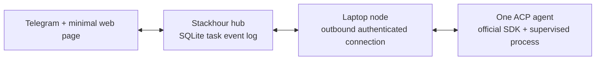
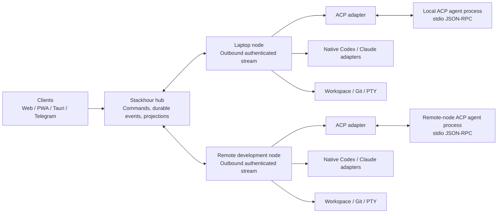
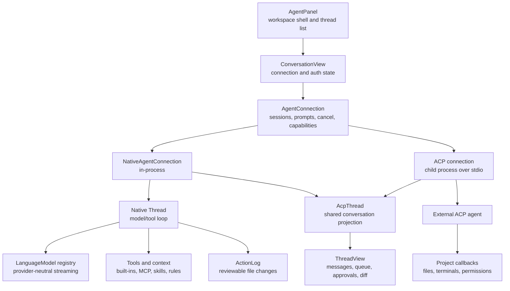

# Remote agent control plane

- Status: Phase 1 transport and CLI-adapter slice implemented
- Reviewed: 2026-07-25
- Supersedes: `t3code-ui-functionality-study.md` and
  `remote-agent-control-plane-and-acp.md`, both folded into this document

This is the single architecture reference for Stackhour's multi-client control
plane for remotely executed coding agents.

It consolidates three source-level studies:

| Reference | Snapshot | What it was read for |
| --- | --- | --- |
| T3 Code | [`ece05087`](https://github.com/pingdotgg/t3code/tree/ece05087a70e94efcd57441337fa1249559362ba) | Product surface, durable command/event model, execution-environment boundary |
| Zed | [`c28cf645`](https://github.com/zed-industries/zed/tree/c28cf645f9b3649611afc5d6df58791cf04d62a9) | Complete agent architecture, native and ACP engines, tool authorization |
| Claude Code | local source snapshot: `remote/`, `services/api/sessionIngress.ts`, `utils/teleport/` | Session transport, reconnect cursors, permission control messages |

The review covered repository documentation, package manifests, contracts,
shared client runtimes, principal web/mobile screens, desktop and SSH code, and
server subsystems. It did not attempt exhaustive behavioral testing or a
pixel-by-pixel visual audit.

None of this is a plan to copy any of the three. T3 Code is the closest
reference, but Stackhour has a different center of gravity: one personal
control plane spanning a laptop, remote development servers, Telegram, desktop,
web/PWA, and eventually mobile.

## Decision

Stackhour should use three different boundaries for three different jobs:

1. **Stackhour domain and event protocol** between clients, the hub, and
   execution nodes. This is the durable product contract.
2. **ACP inside an execution node** as one way to control a local agent
   process. ACP is an engine adapter, not Stackhour's network or persistence
   protocol.
3. **Native engine adapters only after evidence** that Codex, Claude Code, or
   another engine exposes valuable behavior that ACP cannot represent.

The durable identity hierarchy:

```text
Task
  Run
    ProviderSession
```

- A `Task` is the user-visible, durable unit of work shared by Telegram, web,
  PWA, desktop, and mobile clients.
- A `Run` is one execution attempt on one node, checkout, engine, model, and
  access policy.
- A `ProviderSession` is the ACP, Codex, Claude, or other runtime identity used
  to continue a provider conversation.

A provider process can crash, reconnect, upgrade, or be replaced without
changing the identity or history of the task.

## Executive findings

1. **The execution environment is the most useful primitive.** In T3 Code one
   environment owns its projects, files, Git state, terminals, provider
   processes, and agent sessions, and every resource reference is scoped by an
   `environmentId`. Stackhour needs the same explicit location boundary, named
   `node`, but should place it behind one durable hub rather than asking each
   client to connect independently to every node.

2. **The timeline is the product.** Chat messages are only one type of durable
   thread state. Tool activity, approvals, questions, plans, changed files,
   checkpoints, errors, and terminal context all appear in the same work
   history. Model this as structured events from the start; reconstructing it
   later from process output would be brittle.

3. **Git is a first-class interaction surface**, not an integration hidden in
   settings. T3 Code exposes branches, worktrees, per-turn changes, full diffs,
   review comments, commit/push, and pull-request actions beside the
   conversation.

4. **Remote and reconnect behavior are product behavior.** Cached
   shell/thread snapshots, transport health separated from data-sync health,
   retries for transient failures, and environment-scoped operations are all
   worth reusing — but Stackhour nodes should maintain *outbound* connections
   to a hub so sleeping laptops, NAT, Telegram, and web clients share one
   routing model.

5. **Shared contracts and shared client behavior are worth adopting.** Keep
   schema-only contracts separate from client connection/state logic and from
   platform UI. Stackhour's Rust core should own the protocol and domain
   contracts; generated TypeScript types keep React clients honest.

6. **Do not inherit T3 Code's component scale.** At the reviewed snapshot
   `ChatView.tsx` is about 6,000 lines, `Sidebar.tsx` about 3,600, and
   `ChatComposer.tsx` about 2,700. Organize by feature and state machine before
   the UI grows.

7. **A PWA should precede a native mobile app.** T3 Code's React Native client
   shows the cost of full parity: native Markdown, diff, terminal, composer,
   widgets, notifications, adaptive tablet layout, and platform-specific code. A
   responsive PWA covers monitoring, messages, approvals, voice input, and
   lightweight review much sooner.

8. **Approvals must be durable before they are shown.** This is the one point
   where all three references agree by counterexample: Claude Code's pending
   permission map is process memory cleared on disconnect, and Zed's approval
   and follow-up queues are in-memory UI projections. Neither survives the
   multi-client requirement.

## Build now versus preserve for later

The architecture below is a reference end state. It is **not** the scope of the
first implementation. The first slice should prove one differentiating loop:



Build now:

- `Task`, `Run`, `Event`, `Approval`, and stable node identity;
- one append-only SQLite event table with one hub-assigned sequence;
- UUID idempotency for commands and node-originated events;
- reconnect and `after_sequence` catch-up;
- one explicitly configured ACP agent;
- streaming assistant messages, durable approvals, and interrupt;
- approval resolution from either Telegram or the web page.

Preserve as later architecture, but do not implement yet:

- native Codex and Claude adapters;
- a native Stackhour model/tool loop;
- model-provider, tool, context, and review frameworks;
- terminals, worktrees, checkpoint restore, and hunk-level diff review;
- ACP registry installation, subagents, sibling tasks, and offline PWA;
- native mobile.

This keeps the important boundaries without requiring the entire Zed agent
stack before Stackhour's core remote-control claim is validated.

## Target topology



The **hub** owns identity, task history, routing, client sessions,
notifications, and the durable event log. A **node** owns local checkouts,
worktrees, files, Git, terminals, and engine processes. Nodes dial out and
resume with a cursor, so a laptop needs no public inbound port and can sleep or
disappear without corrupting task state. The hub queues work with explicit
expiry and cancellation semantics.

The ACP process runs on the node that owns the checkout. ACP's filesystem and
terminal callbacks are inherently workspace-local, so routing raw ACP between
the hub and an arbitrary client would put the security boundary in the wrong
place.

A responsive multi-client UI needs a long-lived authenticated node protocol
with heartbeats, multiplexed events, cancellation, and reconnect/replay.

## What each reference contributes

| Reference | Adopt | Adapt | Do not copy |
| --- | --- | --- | --- |
| T3 Code | Durable commands, ordered events, projections, receipts, environment boundary, shared client runtime | Put a Stackhour hub in front of multiple outbound-connected nodes | Direct client-to-every-environment topology |
| Claude Code | Separate command ingress and live event stream, stable message IDs, optimistic append chain, reconnect cursors, permission control messages | Persist approvals and normalize SDK events into Stackhour events | Provider-shaped SDK stream as the product domain; memory-only approvals |
| Zed | One UI-facing connection contract for native and ACP agents, capability-driven UI, provider-neutral model streaming, layered tool policy, lazy skills, subagent separation, reviewable diffs | Keep the same boundaries but make Stackhour's hub — not an in-memory thread — the durable authority | GPUI entities, editor-wide remote RPC surface, Zed-specific extensions, GPL source |

---

# Part 1 — T3 Code

## Product surface

### Desktop and web shell

The primary desktop layout is a three-part workbench:

```text
┌────────────────────┬────────────────────────────┬──────────────────────────┐
│ Projects / threads │ Thread timeline            │ Optional work surface    │
│                    │                            │                          │
│ status and recency │ messages and work log      │ diff / terminal / plan   │
│ environment badges │ changed-file summaries     │ browser preview / files  │
│ create/archive     │ approvals and questions    │                          │
├────────────────────┴────────────────────────────┴──────────────────────────┤
│ Composer: context + attachments + provider/model + mode + access + send   │
└───────────────────────────────────────────────────────────────────────────┘
```

- **Left sidebar:** searchable projects containing threads, current work
  status, pull-request/terminal/preview indicators, environment badges,
  creation, rename, archive, settle/snooze, grouping, sorting, and recency
  limits.
- **Thread header:** title plus branch/worktree/environment context and
  source-control actions.
- **Timeline:** user and assistant messages, compact work groups, active-work
  timer, proposed plans, changed-file trees, attachments, review comments,
  copy/revert actions, and a minimap for long histories.
- **Composer:** rich prompt editing, file mentions, pasted/selected images,
  terminal excerpts, browser annotations, review comments, slash commands,
  provider/model selection, reasoning/traits, Build/Plan mode, runtime access
  mode, stop/send actions, pending approvals, and multi-question input.
- **Right panel:** tabbed diff, terminal, plan, browser preview, and file
  surfaces, resizable or maximized, with terminal/browser sessions coexisting
  as tabs.
- **Settings:** general behavior, providers and models, connections, source
  control, keybindings, diagnostics, beta features, and archived threads.

This is denser than a conventional chat UI. The density works because the
conversation stays central while specialist surfaces open beside it instead of
navigating away.

### Thread lifecycle

A T3 thread is durable and broader than a provider session: messages and
attachments, normalized activities such as tools/approvals/failures,
active and previous turns, provider and model selection, interaction and
runtime modes, a worktree or checkout context, checkpoints and per-turn diffs,
proposed plans, archived/settled/snoozed states, and zero or more terminal
sessions.

The provider process may start, reconnect, stop, or fail without redefining the
thread's identity. That separation is the important one for Stackhour: a task
must survive engine restarts, node sleep, client disconnects, and switching
between Telegram and a graphical client.

### Work log and messages

T3 Code normalizes provider-native output into a provider-neutral timeline,
deriving rows for user messages, streaming or complete assistant messages,
grouped tool/work activities, current "working" state and duration, proposed
plans, changed-file summaries, and pending approval or user-input state.

The UI deliberately compresses routine tool traffic. A coding-agent app should
not render every protocol packet as an equally prominent chat bubble. The
useful hierarchy is:

1. user intent and agent outcome;
2. exceptional or actionable events;
3. expandable execution detail.

Stackhour should retain raw engine events for diagnostics while projecting a
smaller stable set of UI event types.

### Composer as command center

The composer combines natural-language input, files and images, terminal
selections, code-review comments, browser element/screenshot annotations, slash
commands, provider/model/model options, Build versus Plan interaction mode,
supervised/automatic/full-access execution policy, and answers to agent
questions and approval decisions.

The lesson is not to implement all controls immediately. It is to define one
**task input envelope** capable of carrying text plus typed context. Telegram
text, a PWA image upload, a selected diff range, and a desktop terminal excerpt
should all become the same Rust-domain command.

### Git, checkpoints, and review

T3 Code captures hidden Git checkpoints around turns and derives changed-file
summaries in the timeline, per-turn diffs, a full-thread diff, split or stacked
diff rendering, selectable comparison bases, file-level navigation, checkpoint
reversion, and review comments appended to the next agent prompt. It also has
provider-neutral source-control services for GitHub, GitLab, Bitbucket, and
Azure DevOps, with branch, commit, push, and change-request flows.

A strong reference for Stackhour, with two changes:

- checkpointing must be explicit about dirty working trees and generated files;
- restore must always be a clearly described, confirmable operation with an
  audit event, never an opaque "undo."

### Terminal, files, and browser preview

The web UI uses xterm for persistent per-thread terminal sessions supporting
open/attach/write/resize/clear/restart/close, output replay after reconnect,
multiple tabs, split groups, link detection, and adding selected terminal text
to the composer. File surfaces provide a workspace tree, text/Markdown/image
preview, editing, drag-to-mention, and review annotations.

The browser preview is desktop-only at the reviewed snapshot. Electron owns a
Chromium `webview` and a Playwright-backed automation/element-picking layer,
while the server tracks per-thread preview sessions and discovered ports. This
cannot be copied directly into Tauri:

- a Tauri WebView is part of the application shell, not an Electron-style
  arbitrary guest `webview`;
- remote preview URLs require careful proxying, origin, cookie, and CSP rules;
- element picking and agent browser automation need a separate capability and
  security design.

Browser preview should be a later desktop capability. The first version can
expose detected ports as links and use an external browser.

### Mobile

The React Native/Expo app is not the responsive web UI in a wrapper. It has
dedicated home/project/thread lists and swipe actions, new-task and
thread-detail flows, approvals and agent questions, Git sheets and progress
overlays, review/diff navigation and review-comment composition, workspace file
browsing and source rendering, native terminal surfaces, connection and pairing
screens, phone/tablet adaptive panes, notifications, live activities, widgets,
share intake, and shortcuts — plus native modules for Markdown
selection/rendering, review diffs, the composer, and a Ghostty-based terminal.

This validates starting Stackhour mobile access as a PWA. Native parity is a
separate product, not a packaging step.

## Architecture

### Server boundary

T3 Code's server owns orchestration and persistence, provider adapters and live
provider processes, projects/worktrees/filesystem/Git, checkpoints and diffs,
PTY processes and output, source-control providers, and preview port discovery.
Clients use typed RPC requests, durable subscriptions, and ordered push events,
with provider-specific streams normalized before reaching UI state.

This is the correct execution boundary. Filesystem paths, Git commands, PTYs,
and provider credentials belong to the machine that executes them.

### Contracts and event projection

The schema-only contracts package defines commands, events, projections,
errors, and environment-scoped identifiers. Orchestration is event-oriented:

```text
client command
    → invariant check / decider
    → persisted domain event
    → projection
    → ordered subscription update
    → client state
```

Background reactors perform provider calls, checkpoint capture, and cleanup.
Typed "receipts" signal asynchronous milestones such as checkpoint completion or
a fully quiet turn, avoiding timing-based polling in tests.

Properties to retain:

- command IDs and durable receipts make retries idempotent;
- subscriptions accept an `afterSequence` cursor;
- a subscriber catches up from a snapshot or event range before going live;
- the client has one connection/retry owner instead of per-feature retries;
- provider output is translated into a provider-neutral task timeline;
- an environment owns its projects, files, Git state, terminals, provider
  processes, and credentials.

Stackhour should adopt the distinction between a **command receipt** (the hub
accepted or rejected the request), **domain events** (durable facts),
**runtime signals** (ephemeral coordination inside one process), and
**projections** (UI-ready current state).

T3's SQLite event store, projections, and command receipts are directly
relevant because Stackhour already uses `rusqlite`. The proposed control-plane
tables extend the existing storage stack; they do not require a new database
technology.

### Shared client runtime

Web and mobile share a client-runtime package owning known environments and
endpoint resolution, authentication and credential persistence, connection
supervision and retry, RPC sessions and subscriptions, cached shell/thread
state, and focused domain state modules. Its most useful details:

- one retry owner per environment;
- connectivity-aware backoff, capped at 16 seconds;
- explicit wakeups for network, app, and credential changes;
- cached state remains readable offline;
- transport health and domain synchronization health are separate;
- a new live generation cannot be overwritten by stale cache hydration;
- React components do not construct sockets or retry loops.

Stackhour's TypeScript client runtime should follow these ownership rules even
where the protocol and topology differ.

### Remote execution — the one mismatch

T3 Code models an execution environment independently from how it is reached:
direct HTTP/WebSocket, LAN or Tailscale endpoints, HTTPS/WSS tunnels, an
Electron-managed SSH launch with local port forwarding, or a managed relay.
Pairing exchanges a one-time credential for a session. The hosted web app
stores environments locally and connects directly to their backends; it is not
a proxy or central control plane.

That last point is the main mismatch with Stackhour. Direct per-environment
connections are elegant for T3 Code but weaker here:

- Telegram already needs an always-on coordinator;
- a browser should not need credentials and network reachability for every
  development box;
- a laptop behind NAT or asleep should reconnect without changing client
  configuration;
- one task history should remain available when its execution node is offline;
- future scheduling across nodes belongs in one place.

---

# Part 2 — Claude Code

Claude Code's remote implementation is a useful reference for session
transport:

- user commands enter over an HTTP-style append operation;
- a WebSocket carries SDK events and control messages;
- permission requests, responses, cancellation, and interrupt are explicit
  protocol messages;
- stable UUIDs allow optimistic user messages to be reconciled with echoed
  server events;
- session ingress serializes writes per session;
- each append includes the previous UUID, forming an optimistic chain;
- an uncertain write can recover from a conflict instead of blindly
  duplicating the command;
- history uses opaque cursor pagination, while the live stream resumes from a
  last-seen event ID.

The mechanics are useful; the state ownership is too provider-specific:

- the pending permission map is process memory, cleared on disconnect;
- reconnect attempts are capped;
- the event stream exposes Claude SDK concepts rather than stable Stackhour
  domain events;
- the central service and its retention behavior are not under Stackhour's
  control.

Copy the mechanics, not the data model. Approval requests must become durable
hub entities before they are shown in Telegram or a graphical client.

---

# Part 3 — Zed

## ACP

### Roles and negotiation

In Zed the editor is the ACP **client** and the external coding agent is the
ACP **agent**. Zed launches the agent as a child process and exchanges
line-delimited JSON-RPC over the child's stdin and stdout. Stderr is captured
separately for diagnostics. Dropping the connection kills the child.

Initialization sends protocol version V1, client implementation metadata, and
client capabilities. Zed validates the returned protocol version and stores
agent implementation and version, agent capabilities, authentication methods,
supported session operations, prompt capabilities, and modes and configuration
options.

This negotiation matters. ACP agents do not all implement the same surface.
Load, resume, close, list, delete, extra directories, modes, model selection,
configuration options, authentication, and logout must be exposed only when the
connected agent advertises them.

Zed notes a current limitation: ACP prompt capabilities are connection-wide and
cannot change per session. Stackhour should store the negotiated capability
snapshot on each run, but must be able to refresh it when a new connection is
established.

### Session lifecycle

Zed's ACP connection supports `session/new`; optional `session/load`,
`session/resume`, `session/close`, and session list/delete; prompt as a
request/response operation; streamed `session/update` notifications during the
prompt; cancellation as a notification; session modes and typed configuration
options; and agent, environment-variable, and terminal-based authentication.

For session loading, Zed registers the pending session *before* sending the
load request, so historical replay notifications have a target even before the
load RPC completes. Concurrent opens of the same session share the in-flight
operation and use reference counts.

Stackhour needs the same ordering rule: create the local `ProviderSession`
projection before starting new/load/resume, then accept provider events. The
hub event log remains the source of truth even when the provider cannot load or
resume its own session.

### Agent-to-client callbacks

The reviewed Zed client advertises text file read and write; terminal creation,
output, exit waiting, kill, and release; permission requests; form and URL
elicitations; terminal authentication; and boolean session configuration
options.

Callbacks are handled by Zed's project and terminal layers, not by the agent
process directly. Incoming protocol work is forwarded from the thread-safe
JSON-RPC handler to the GPUI foreground thread through a queue — a useful
separation between transport parsing and state mutation. Stackhour's
equivalent:

```text
ACP transport
  -> validated adapter message
  -> node runtime command
  -> workspace / terminal / approval policy
  -> ACP response
  -> normalized Stackhour event
```

**ACP capability advertisement is not authorization.** Advertising file or
terminal support only means the node *can* service such a request. The node
must still apply the run's access policy, allowed checkout roots, command
policy, environment filtering, and any required user approval.

### Session updates

Zed projects `session/update` notifications into a thread model with user
message chunks, assistant message chunks, agent thought chunks, tool calls and
tool-call updates, plans, title and session metadata, available commands,
current mode and configuration changes, and token usage and cost.

It optimistically inserts a user message and then suppresses a matching echoed
chunk from the agent, and turns prompt stop reasons such as cancellation,
refusal, and maximum-token termination into explicit UI state.

Valuable normalization examples — but Stackhour should normalize into its own
durable vocabulary rather than persisting Zed's `AcpThread` entries.

### Discovery and installation

Zed supports both custom commands and an ACP registry. Registry entries resolve
to npm packages or platform archives. The command builder combines the project
environment, registry environment, user settings, and per-launch overrides. Zed
includes known registry IDs for Gemini, Claude ACP, Codex ACP, and Cursor,
while retaining a generic custom-agent path.

For remote projects, Zed asks the workspace-owning side to resolve the agent
command and environment. This reinforces the node boundary: installation,
executable discovery, credentials, and process launch belong to the execution
node.

Stackhour should begin with explicit local agent definitions and add registry
installation later. Automatic downloads are a supply-chain feature needing
version pinning, checksums, provenance, update policy, and an auditable user
decision.

### Licensing boundary

The reviewed Zed `acp_thread` and `agent_servers` crates are licensed
GPL-3.0-or-later, while Stackhour is MIT licensed. **Do not copy their
implementation into Stackhour.**

Use Zed as an architecture and behavior reference, then implement an
independent ACP client against the official protocol specification and a
dependency whose license has been reviewed. Zed-specific metadata extensions
such as its terminal-output fields should not become required Stackhour
behavior.

The official ACP SDK is the preferred protocol dependency. Pin its version,
verify its Apache-2.0 license at that version, and preserve required notices.
Independent implementation here means Stackhour owns process supervision,
policy, and event normalization; it does not mean rewriting protocol types and
JSON-RPC framing already supplied by the SDK.

## Overall agent architecture

### Layer map

Zed's most useful architectural decision is that the native in-process agent
and external ACP agents meet the UI through the same `AgentConnection`
contract:



The native engine does not run ACP internally. `NativeAgentServer` creates an
in-process `NativeAgent`, while the ACP path supervises an external process.
Both adapt their events into the same conversation projection, preserving
native capabilities without maintaining two user interfaces.

Stackhour should copy this shape with its own names and domain:

```text
EngineConnection
  NativeEngineConnection
  AcpEngineConnection
  CodexEngineConnection
  ClaudeEngineConnection

All produce Stackhour RunEvents.
```

`EngineConnection` should be an operational adapter contract, not the durable
domain. A provider session can be reconstructed or replaced; a Stackhour
`Task`, `Run`, approval, question, and accepted artifact must survive it.

### Native turn engine

Zed's native `Thread` owns the model/tool loop. For each model round it
compacts context when needed, re-reads the selected model and enabled tool
profile, creates a provider-neutral completion request, streams text/thinking/
usage/tool calls, starts tools as their inputs become available, collects
parallel tool results, and appends structured results until a terminal stop
reason.

Re-reading model and tool settings between rounds lets a user change the
profile or model *during* a turn. Tools can execute concurrently, while
cancellation, refusal, token limits, retries, and compaction remain explicit
thread states.

The language-model layer is independent of the agent loop. Providers implement
one model interface and emit normalized events such as text, reasoning, tool
use, usage, stop, and compaction. The registry separately selects models for
the main agent, summaries, compaction, and inline assistance.

For Stackhour this implies two distinct extension points:

- an **engine** controls session and agent-loop behavior;
- a **model provider** performs inference.

A native Stackhour engine should be able to change model provider without
changing the task or engine identity. Conversely, an ACP engine may own its
model selection internally.

### Tools, authorization, and sandboxing

Zed's native tools expose JSON-schema input, streaming input updates, a run
operation, and a replay operation. Replay rebuilds UI state after loading a
thread without re-running side effects. Built-ins cover files, search, editing,
diagnostics, terminal execution, navigation, web access, subagents, and sibling
threads. MCP/context-server tools merge into the active tool set with
conflicting names qualified.

Tool availability, authorization, and sandbox access are separate layers:

- a profile determines which tools the model sees;
- immutable destructive-command rules deny known dangerous operations;
- configured deny, confirm, and allow patterns apply in that order;
- per-tool and global defaults apply only after the stronger rules;
- workspace trust can remove tools before inference;
- canonical path checks prevent symlink and worktree escape;
- sandbox grants independently control network, filesystem writes, and
  unsandboxed execution;
- grants have explicit once, thread, or persistent scope.

Command policy parses chained subcommands instead of testing the raw string as
one unit, so a permitted prefix cannot hide a later destructive command. Zed
also re-checks authorization immediately before execution, reducing
time-of-check/time-of-use problems.

Stackhour should put this policy engine below every runtime adapter. ACP
capabilities and a model's requested tool call are descriptions of possible
operations, never authorization. The hub persists the approval and its scope;
the execution node enforces the final path, process, environment, network, and
sandbox decision.

### Context, rules, skills, and MCP

Zed builds project context from worktrees, operating-system and shell
information, project rules, and a compact skill catalog. It recognizes common
agent instruction files, combines personal and project instructions, and
refreshes context when project state changes.

Skills use progressive disclosure:

- the system prompt gets only skill name, description, and location;
- the model loads a skill body on demand through a tool;
- global and project-local skills are distinct;
- project skills require a trusted worktree;
- project definitions override global definitions with the same name;
- skill content is escaped before prompt insertion;
- edits to skills and other persistent instruction paths require stronger
  approval.

Project context is not replaced when a refresh is byte-for-byte equivalent,
which helps preserve model prompt-cache prefixes.

A good pattern for Stackhour: the execution node should resolve
filesystem-backed rules, skills, and MCP servers near the workspace, while the
hub stores provenance, hashes, activation events, and policy metadata without
unnecessary uploads of private local content.

### Child agents versus sibling tasks

Zed distinguishes two kinds of delegation:

- a **subagent** is a child of the current agent turn, receives a self-contained
  prompt, and returns a result to its parent;
- a **sibling thread** is an independent user-visible conversation, optionally
  created with its own Git worktree, and does not return a tool result to the
  original thread.

Native subagents share project context and tools, have their own session and
action log, and can roll their changes into the parent's review surface. The
reviewed implementation limits nesting to one level, and deleting a root thread
removes persisted descendants.

Stackhour should represent these differently:

- child `Run` or `Subtask`: causally linked to a parent run, expected to
  produce a result;
- sibling `Task`: independent durable work appearing in every client;
- checkout/worktree selection: an execution policy attached to a run, not an
  agent-protocol concept.

### Conversation state and command queue

Zed separates the provider session ID from a stable thread metadata ID, so
draft prompts can exist before a provider session is created. User title
overrides are stored separately so a later agent-generated title cannot replace
them.

While a response is streaming, follow-up messages can be queued with distinct
semantics: wait until the current response completes; steer at the next turn
boundary; or cancel and send immediately. Permissions and elicitations are
presented as ordered queues across the conversation, and capabilities drive
whether model, mode, authentication, configuration, load, and resume controls
appear.

In Zed much of this is an in-memory UI projection backed by provider-specific
history. Stackhour needs queue operations, drafts, approvals, questions,
interrupts, and title overrides as durable commands and events so Telegram,
web, PWA, and desktop clients cannot disagree.

### File-change review

Zed's `ActionLog` tracks buffers read, created, edited, and deleted by an agent,
maintaining a diff base and unreviewed patch independently of the current
buffer. Users can accept or reject individual ranges or all changes, and undo
the most recent rejection. Created files, overwritten files, deleted files,
external user edits, and stale reads receive different handling. Linked action
logs let a subagent keep an individual diff while contributing its reads and
writes to the parent review experience. File read times and buffer versions
help detect external modification.

For Stackhour, `tool.completed` must not imply `change.accepted`. Store these as
separate concepts:

```text
file_change.proposed
file_change.updated
file_change.accepted
file_change.rejected
file_change.rejection_undone
```

Large patches can remain artifact-backed, but the decision, actor, base
revision, affected paths, and resulting Git/checkpoint identity should be
durable. Rejection must verify the base before mutating a file that may have
changed on another client or outside the agent.

### Local and remote projects

Zed's agent UI stays on the client, while its `Project` abstraction can proxy
buffers, Git, language servers, tasks, settings, and terminals to the machine
owning a remote workspace. The native agent remains in process with the UI but
invokes tools through that project abstraction, and external agent commands are
resolved and launched on the workspace-owning side.

This validates locality — tools and agent processes should execute beside the
checkout — but Zed's editor-wide remote object graph is broader than Stackhour
needs. Stackhour should expose a narrow node protocol for task execution,
artifacts, terminals, Git, approvals, and capability discovery. The durable hub
should not mirror every editor object.

### Persistence and limitations

Zed uses two persistence layers: native thread content as compressed JSON in
SQLite (messages, model, profile, usage, draft, UI position, subagent state,
sandbox data), and lightweight metadata tracking native and ACP threads for the
common sidebar (stable thread ID, provider session ID, agent, title,
timestamps, workspace paths, remote connection, archive state).

External ACP agents remain responsible for replaying provider history when they
support load/resume. Appropriate for a desktop editor, insufficient for a
multi-client remote control plane. Stackhour's hub must own a canonical,
provider-neutral event history; provider history is only a continuation and
recovery aid.

---

# Part 4 — The Stackhour model

## Adopt, adapt, reject

| Pattern | Decision | Reason |
|---|---|---|
| Environment-scoped resources | **Adopt as `nodeId`** | Prevents path, process, terminal, and Git ambiguity across machines. |
| Server owns execution resources | **Adopt** | The node containing the checkout must own filesystem, Git, PTY, and engine processes. |
| Durable thread above provider session | **Adopt** | Tasks must survive reconnects, restarts, and client switching. |
| Typed command/event/projection contracts | **Adopt** | Required for several clients and an agent-written codebase. |
| Ordered event delivery and replay | **Adopt** | Enables deterministic UI state and reconnect. |
| Cached offline shell/thread state | **Adopt** | Essential for mobile/PWA and sleeping nodes. |
| One connection interface across native and ACP engines | **Adopt** | Adds engines later without a second UI. |
| Separate engine and model-provider abstractions | **Adopt** | Inference choice must not change task or engine identity. |
| Capability-driven controls | **Adopt** | ACP agents differ; only show what the agent advertises. |
| Layered profiles, approvals, workspace trust, sandbox policy | **Adopt** | Capability is not authorization. |
| Progressive skill and context loading | **Adopt** | Keeps prompts small and cache prefixes stable. |
| Reviewable changes distinct from tool completion | **Adopt** | `tool.completed` is not `change.accepted`. |
| Stable Stackhour IDs distinct from provider session IDs | **Adopt** | Provider sessions are replaceable; tasks are not. |
| Timeline with compressed tool activity | **Adopt** | Preserves clarity without hiding execution evidence. |
| Diff, terminal, plan, files as side panels | **Adopt** | Keeps task context stable while inspecting work. |
| Worktree per thread | **Adapt** | Offer existing checkout, new worktree, and later ephemeral clone; do not force one mode. |
| Per-turn checkpoints and diffs | **Adopt incrementally** | High product value, but restore safety needs explicit design. |
| SSH as desktop launch helper | **Adapt as bootstrap only** | Useful for installation and recovery, not the steady-state protocol. |
| Direct client-to-environment networking | **Reject as default** | Conflicts with Telegram, unified history, NAT traversal, centralized scheduling. |
| ACP types as the product database schema | **Reject** | The durable domain must outlive any one protocol. |
| In-memory approval or follow-up queues | **Reject** | Multi-client state cannot live in one process's memory. |
| Provider-owned history as the only copy | **Reject** | The hub must hold canonical history. |
| Full editor remote-object graph | **Reject** | Stackhour needs a narrow node protocol. |
| Electron desktop shell and its browser preview | **Reject** | Stackhour selected React + Tauri; keep native privileges narrow. |
| Separate React Native app immediately | **Defer** | A PWA reaches useful remote control much faster. |
| Very large orchestration components | **Reject** | Poor fit for an agent-written codebase and parallel development. |
| GPUI entities or GPL implementation code | **Reject** | Stackhour is MIT; Zed's ACP crates are GPL-3.0-or-later. |

## Initial core entities

Keep the first domain deliberately small:

- `Node`: stable identity, label, connection status, software version, and a
  small capability snapshot.
- `Task`: durable user intent and lifecycle, independent of an engine process.
- `Run`: one attempt on one node with one configured ACP agent and access
  policy.
- `Event`: ordered durable task history.
- `Approval`: actionable request with scope, expiry, decision, and actor.

For the vertical slice, a run may carry a configured workspace path without
introducing first-class `Project` and `Checkout` tables. Add those when one
logical repository actually needs multiple node-local checkouts. Add `Artifact`
and `TerminalSession` when large outputs and interactive PTYs enter the
product.

Do not call every task a "chat." Telegram may look chat-like, but the domain is
a remotely executed task with a conversation timeline.

## Initial event vocabulary

Start with stable product events rather than provider packets:

- `task.created`;
- `run.started`, `run.interrupted`, `run.completed`, `run.failed`;
- `message.user`, `message.assistant.delta`, `message.assistant.completed`;
- `approval.requested`, `approval.resolved`;
- `node.connected`, `node.disconnected`.

Store raw provider payloads separately or behind a versioned diagnostic field;
UI projections must not depend on them. Add activities, questions, plans, file
changes, checkpoints, artifacts, and terminal events only with the features
that consume them. The richer vocabulary elsewhere in this document is a naming
reference, not an instruction to implement unused event types.

## ACP mapping

ACP messages should be normalized at the node boundary:

| ACP concept | Stackhour representation |
| --- | --- |
| Connection initialization | `engine.connected` plus negotiated capability snapshot |
| Agent process exit or transport failure | `engine.disconnected`; fail or pause the active run per restart policy |
| `session/new`, `load`, or `resume` | `provider_session.opened` linked to a `Run` |
| Prompt request | node command caused by `run.start` or `message.send` |
| User message chunk | reconcile with the durable `message.user` command using a client message ID |
| Agent message chunk | `message.assistant.delta` |
| Prompt response | `message.assistant.completed` and a terminal run state derived from stop reason |
| Agent thought chunk | optional `activity.updated`, subject to privacy and retention policy |
| Tool call/update | `activity.started`, `activity.updated`, or `activity.completed` |
| Plan update | `plan.updated` |
| Permission request | durable `approval.requested`; response only after `approval.resolved` |
| Elicitation | durable `question.requested` and `question.answered` |
| Usage/cost update | `usage.updated` on the run |
| File callback | node-local capability operation plus an audit event; content is not copied into the main event log |
| Terminal callback | node-local PTY plus resumable terminal metadata and chunked output |
| Cancel notification | node effect caused by durable `run.interrupt` |

Keep raw ACP packets in an optional, versioned diagnostic stream with bounded
retention. UI projections and automation must not depend on raw packets.

## Durable data model

For the first slice, commands and events need `command_id`; `event_id`; one
hub-assigned `sequence`; `task_id`; `run_id` when the event belongs to an
execution attempt; `provider_session_id` when known; `node_id`;
`protocol_version`; and `occurred_at` plus hub receipt time.

The initial hub should persist:

- tasks and runs;
- the ordered task event log;
- idempotent command receipts;
- approvals, including expiry and resolution actor;
- node identity, capability snapshots, and last-seen cursor;
- provider session references and bounded diagnostic data.

SQLite queries can project the first UI directly. Add dedicated projection
tables only after measured query or product requirements justify them.
`causation_id`, `correlation_id`, node-local sequences, artifact storage, and
separate high-volume streams remain compatible future extensions, not initial
schema requirements.

## Reconnect and idempotency rules

1. A client sends every mutation with a stable `command_id`.
2. The hub stores the command receipt and resulting event sequence atomically.
3. A node-originated event has a stable UUID; the hub deduplicates it before
   assigning the one global sequence.
4. A node acknowledges commands it has accepted, and retries use the same UUID
   rather than creating a new effect.
5. Clients subscribe with `after_sequence`, catch up, and then switch to live
   delivery without a gap.
6. Optimistic user messages carry a stable client message ID so provider echoes
   can be reconciled.
7. Reconnection does not have a small fixed retry ceiling. Backoff is bounded,
   jittered, and continues until the user disables the node or credentials
   require intervention.

ACP itself does not provide this distributed durability. The node adapter must
translate its local, process-scoped stream into the rules above.

Introduce a separate node sequence only if offline node spooling or multiple
hub writers demonstrate a real ordering problem that UUID deduplication cannot
solve.

## Approval and security model

An ACP permission request must never wait only in an in-memory callback. The
node should:

1. receive the ACP permission request;
2. persist/send `approval.requested` to the hub with the tool-call ID, options,
   requested scope, node, checkout, command or path summary, and expiry;
3. keep the ACP request pending while any authorized client may decide it;
4. receive the durable `approval.resolved` command;
5. verify that the decision still applies to the same run and request;
6. answer the ACP request;
7. emit the resulting tool status.

If the node disconnects, the approval remains visible but becomes
non-actionable until the node reconnects or the request expires. A late or
duplicate decision must be idempotent.

Separate these permissions:

- read workspace files;
- write workspace files;
- execute commands;
- use the network;
- read terminal output;
- send terminal input;
- access secrets or credential brokers;
- operate outside the configured checkout roots.

An `allow always` choice must have an explicit scope such as this run, this
task, this checkout, this node, or a named policy. It must not silently become
unbounded machine access.

For the first vertical slice, expose only the permission choices the selected
ACP agent actually requests. Default to one-request allow or deny. Add
run/checkout/node persistence scopes and a richer policy matrix after the
approval loop is proven and audited.

## Initial UI slice

The first React UI should contain only:

1. a task list;
2. a reconnect-safe message timeline;
3. a text composer;
4. laptop-node online/offline state;
5. approval cards usable from both web and Telegram;
6. interrupt and a visible final run state.

Telegram should expose the same task/run/approval model with a narrower view,
not a separate job system. A task created in Telegram must open in the PWA or
desktop with its full history, and a graphical-client approval must resolve the
Telegram card too.

Node selection, project browsing, files, images, model controls, diffs,
terminals, and settings follow after the loop is reliable.

## Initial code boundaries

```text
crates/
  stackhour-domain
    task, run, event, approval, IDs, SQLite persistence

  stackhour-hub
    client and Telegram API
    ordered subscriptions and command receipts
    node authentication and routing

  stackhour-node
    outbound hub connection and run supervision
    ACP adapter module using the official Apache-2.0 SDK
    one configured workspace and agent process
```

Keep protocol types in `stackhour-domain` and ACP inside `stackhour-node` until
another consumer or adapter proves a real extraction boundary. Keep Telegram
inside the hub while it is one small client projection.

The React UI can remain one application organized by feature. Generated
TypeScript contracts and a shared client runtime become justified when the
Tauri shell or another rich client actually consumes them.

Possible future seams include `protocol`, `runtime`, `models`, `context`,
`tools`, `acp`, `terminal`, `git`, and `review`. These are logical boundaries in
the target architecture, not crates to create preemptively. Split them when
they have multiple consumers, an independent lifecycle, or dependencies worth
isolating.

## Implementation sequence

Implemented on 2026-07-28:

- durable tasks, runs, events, command receipts, nodes, and approvals;
- authenticated client and outbound node WebSocket links;
- durable offline node command delivery and reconnect replay;
- a small web operator client and Telegram projection;
- native Claude and Codex CLI adapters;
- interrupt, heartbeat, event resume, and command/event deduplication.

The current adapter uses the Claude and Codex command-line programs. ACP and
durable tool approval handling remain future work.

### Phase 1 — prove one ACP task end to end

- Add the five initial entities and the append-only SQLite event table.
- Assign one sequence at the hub and deduplicate commands and events by UUID.
- Project Telegram through the task/run model.
- Add an authenticated outbound laptop-node connection with reconnect,
  `after_sequence` catch-up, heartbeat, and interrupt.
- Use the official ACP SDK around one explicitly configured agent.
- Stream user and assistant messages into both Telegram and a minimal web task
  page.

### Phase 2 — prove remote approval

- Persist `approval.requested` before presenting it.
- Resolve the same approval from Telegram or the minimal web page.
- Test duplicate decisions, expiry, interruption, and disconnect while an
  approval is pending.

### Phase 3 — harden the hub, add the shared web/PWA

- Define client and node authentication, credential rotation, backup, restore
  testing, upgrade, and recovery before relying on the hub as the only copy.
- Build the responsive shell, task navigation, timeline, composer, approvals,
  and connection diagnostics.
- Make streaming and reconnection correct before adding specialist panels.
- Add node/project selection and attachments only after the single-node path is
  reliable.
- Add the remote development node using the same node binary.
- Add service-worker installation later in this phase; do not promise offline
  execution.

### Phase 4 — Tauri desktop and the development workbench

- Package the shared React application; add only capabilities needing a trusted
  local shell — secure credential storage, notifications, local node
  bootstrap/control, file dialogs, and opening editors or external terminals.
- Keep domain state and networking in the shared client runtime.
- Add project/checkout identity, attachments, artifacts, Git status/branch
  actions, read-only diff, terminal, files, worktrees, per-turn checkpoints, and
  safe restore — one feature at a time.
- Add source-control provider actions after local Git flows are reliable.
- Treat browser preview and automation as a separate security-reviewed feature.
- Add discovery and installation only with pinning, checksums, provenance,
  visible updates, and rollback.

### Phase 5 — richer engines and native mobile, only with evidence

- Measure ACP event fidelity, recovery, tool semantics, and missing features.
- Add a native Codex or Claude adapter only for a material demonstrated gap,
  normalizing every adapter into the same Stackhour task timeline.
- Give a native Stackhour engine a separate RFC; do not create model, context,
  tool, or subagent frameworks before that RFC is approved.
- Measure PWA limitations in daily use. Build React Native only for
  capabilities whose value exceeds maintaining a second UI implementation:
  reliable push/background behavior, share extensions, widgets/live activities,
  or high-performance terminal/review.

## Acceptance tests

The first vertical slice is complete when:

- a task started in Telegram opens with the same history on the web;
- the laptop can sleep during streaming, reconnect, and recover without
  duplicated messages or events;
- an ACP permission requested on the laptop is durably visible and resolvable
  from Telegram or web;
- an approval survives disconnection and can resolve or expire safely after
  reconnect;
- retrying the same client command produces only one durable effect;
- killing an ACP child process exposes an actionable run state;
- cancelling a prompt from one client reflects the final run state in all
  clients.

Later architecture remains accountable to these tests when its features are
implemented:

- run the same task on either the laptop or remote development node;
- load or resume only when the agent advertises the capability;
- reject a file path outside the run's allowed checkout roots;
- queue a follow-up from one client and steer or interrupt it from another
  without duplicating the message;
- run a child subtask and preserve both its own result and its causal link to
  the parent run;
- propose agent file changes, accept one hunk, reject another from a different
  client, and detect a stale base safely;
- reload a task timeline without replaying tool side effects;
- upgrade hub and node independently within the supported protocol window.

## Risks and open decisions

- **Hub placement:** the existing Linux coordinator is the natural first hub,
  but client authentication, backup, restore testing, upgrades, and recovery
  must be implemented before it becomes the only source of task history.
- **Node trust:** decide whether a paired node is fully trusted or receives
  per-project/per-capability grants.
- **Terminal security:** terminal read access, terminal input, and agent access
  are different permissions and should not collapse into one "full access"
  toggle.
- **Offline commands:** commands sent while a node sleeps need explicit
  queued/cancelled/expired semantics.
- **Worktree policy:** users need a visible choice among current checkout, new
  worktree, and possibly ephemeral clone.
- **Concurrent clients:** command IDs and optimistic UI must make repeated
  Telegram/PWA actions idempotent.
- **Event retention:** high-volume terminal and provider events should use
  chunked artifacts or a separate stream so the primary task log stays small.
- **Version skew:** hub, node, desktop, PWA, and Telegram may update at
  different times; capability negotiation is required from the first protocol
  version.

## Documentation drift, observed and self-inflicted

T3 Code's source moves faster than some of its documentation:

- `docs/architecture/providers.md` says only Codex is implemented, while the
  reviewed source registers Codex, Claude, Cursor, Grok, and OpenCode drivers;
- the README lists four providers and omits the registered Grok driver;
- `docs/project/todo.md` still lists thread archiving while archiving exists in
  contracts and in both desktop and web UI code.

This is not a criticism of an early, fast-moving project; it is a warning.
Stackhour hit the same failure during the Rust port: documentation lagged
behind shipped behavior and its tests.

Maintain a generated capability matrix from the Rust registry and protocol, and
distinguish `implemented`, `tested`, `exposed`, and `operationally proven`.
Those states must not be conflated.

## Reference source index

### T3 Code

- [Architecture overview](https://github.com/pingdotgg/t3code/blob/ece05087a70e94efcd57441337fa1249559362ba/docs/architecture/overview.md)
- [Remote architecture](https://github.com/pingdotgg/t3code/blob/ece05087a70e94efcd57441337fa1249559362ba/docs/architecture/remote.md)
- [Connection runtime](https://github.com/pingdotgg/t3code/blob/ece05087a70e94efcd57441337fa1249559362ba/docs/architecture/connection-runtime.md)
- [Orchestration contracts](https://github.com/pingdotgg/t3code/blob/ece05087a70e94efcd57441337fa1249559362ba/packages/contracts/src/orchestration.ts)
- [Orchestration engine](https://github.com/pingdotgg/t3code/blob/ece05087a70e94efcd57441337fa1249559362ba/apps/server/src/orchestration/Layers/OrchestrationEngine.ts)
- [Environment contracts](https://github.com/pingdotgg/t3code/blob/ece05087a70e94efcd57441337fa1249559362ba/packages/contracts/src/environment.ts)
- [Shared client runtime](https://github.com/pingdotgg/t3code/blob/ece05087a70e94efcd57441337fa1249559362ba/packages/client-runtime/README.md)
- [Web chat composition](https://github.com/pingdotgg/t3code/blob/ece05087a70e94efcd57441337fa1249559362ba/apps/web/src/components/ChatView.tsx)
- [Web timeline](https://github.com/pingdotgg/t3code/blob/ece05087a70e94efcd57441337fa1249559362ba/apps/web/src/components/chat/MessagesTimeline.tsx)
- [Web composer](https://github.com/pingdotgg/t3code/blob/ece05087a70e94efcd57441337fa1249559362ba/apps/web/src/components/chat/ChatComposer.tsx)
- [Web sidebar](https://github.com/pingdotgg/t3code/blob/ece05087a70e94efcd57441337fa1249559362ba/apps/web/src/components/Sidebar.tsx)
- [Web diff panel](https://github.com/pingdotgg/t3code/blob/ece05087a70e94efcd57441337fa1249559362ba/apps/web/src/components/DiffPanel.tsx)
- [Web terminal](https://github.com/pingdotgg/t3code/blob/ece05087a70e94efcd57441337fa1249559362ba/apps/web/src/components/ThreadTerminalDrawer.tsx)
- [Desktop SSH environment](https://github.com/pingdotgg/t3code/blob/ece05087a70e94efcd57441337fa1249559362ba/apps/desktop/src/ssh/DesktopSshEnvironment.ts)
- [Mobile thread detail](https://github.com/pingdotgg/t3code/blob/ece05087a70e94efcd57441337fa1249559362ba/apps/mobile/src/features/threads/ThreadDetailScreen.tsx)
- [Mobile review](https://github.com/pingdotgg/t3code/blob/ece05087a70e94efcd57441337fa1249559362ba/apps/mobile/src/features/review/ReviewSheet.tsx)
- [Mobile terminal](https://github.com/pingdotgg/t3code/blob/ece05087a70e94efcd57441337fa1249559362ba/apps/mobile/src/features/terminal/ThreadTerminalRouteScreen.tsx)

### Claude Code local source snapshot

- `remote/RemoteSessionManager.ts`
- `remote/SessionsWebSocket.ts`
- `remote/sdkMessageAdapter.ts`
- `services/api/sessionIngress.ts`
- `utils/teleport/api.ts`

### Zed

- [Agent UI entry point](https://github.com/zed-industries/zed/blob/c28cf645f9b3649611afc5d6df58791cf04d62a9/crates/agent_ui/src/agent_panel.rs)
- [Shared conversation connection store](https://github.com/zed-industries/zed/blob/c28cf645f9b3649611afc5d6df58791cf04d62a9/crates/agent_ui/src/agent_connection_store.rs)
- [Native agent server adapter](https://github.com/zed-industries/zed/blob/c28cf645f9b3649611afc5d6df58791cf04d62a9/crates/agent/src/native_agent_server.rs)
- [Native agent connection and session projection](https://github.com/zed-industries/zed/blob/c28cf645f9b3649611afc5d6df58791cf04d62a9/crates/agent/src/agent.rs)
- [Native thread and tool loop](https://github.com/zed-industries/zed/blob/c28cf645f9b3649611afc5d6df58791cf04d62a9/crates/agent/src/thread.rs)
- [Language model interface](https://github.com/zed-industries/zed/blob/c28cf645f9b3649611afc5d6df58791cf04d62a9/crates/language_model/src/language_model.rs)
- [Configured tool permissions](https://github.com/zed-industries/zed/blob/c28cf645f9b3649611afc5d6df58791cf04d62a9/crates/agent_settings/src/agent_settings.rs)
- [Runtime tool authorization](https://github.com/zed-industries/zed/blob/c28cf645f9b3649611afc5d6df58791cf04d62a9/crates/agent/src/tool_permissions.rs)
- [Agent skills architecture](https://github.com/zed-industries/zed/blob/c28cf645f9b3649611afc5d6df58791cf04d62a9/crates/agent_skills/README.md)
- [Project context and instruction discovery](https://github.com/zed-industries/zed/blob/c28cf645f9b3649611afc5d6df58791cf04d62a9/crates/prompt_store/src/prompts.rs)
- [Agent action log and diff review](https://github.com/zed-industries/zed/blob/c28cf645f9b3649611afc5d6df58791cf04d62a9/crates/action_log/src/action_log.rs)
- [Native thread persistence](https://github.com/zed-industries/zed/blob/c28cf645f9b3649611afc5d6df58791cf04d62a9/crates/agent/src/db.rs)
- [Cross-agent thread metadata](https://github.com/zed-industries/zed/blob/c28cf645f9b3649611afc5d6df58791cf04d62a9/crates/agent_ui/src/thread_metadata_store.rs)
- [Remote project construction](https://github.com/zed-industries/zed/blob/c28cf645f9b3649611afc5d6df58791cf04d62a9/crates/project/src/project.rs)
- [ACP connection and process transport](https://github.com/zed-industries/zed/blob/c28cf645f9b3649611afc5d6df58791cf04d62a9/crates/agent_servers/src/acp.rs)
- [ACP connection abstraction](https://github.com/zed-industries/zed/blob/c28cf645f9b3649611afc5d6df58791cf04d62a9/crates/acp_thread/src/connection.rs)
- [ACP thread projection](https://github.com/zed-industries/zed/blob/c28cf645f9b3649611afc5d6df58791cf04d62a9/crates/acp_thread/src/acp_thread.rs)
- [Custom and registry agent integration](https://github.com/zed-industries/zed/blob/c28cf645f9b3649611afc5d6df58791cf04d62a9/crates/agent_servers/src/custom.rs)
- [Agent discovery and remote command resolution](https://github.com/zed-industries/zed/blob/c28cf645f9b3649611afc5d6df58791cf04d62a9/crates/project/src/agent_server_store.rs)
- [ACP thread crate license](https://github.com/zed-industries/zed/blob/c28cf645f9b3649611afc5d6df58791cf04d62a9/crates/acp_thread/Cargo.toml)
- [Agent servers crate license](https://github.com/zed-industries/zed/blob/c28cf645f9b3649611afc5d6df58791cf04d62a9/crates/agent_servers/Cargo.toml)
