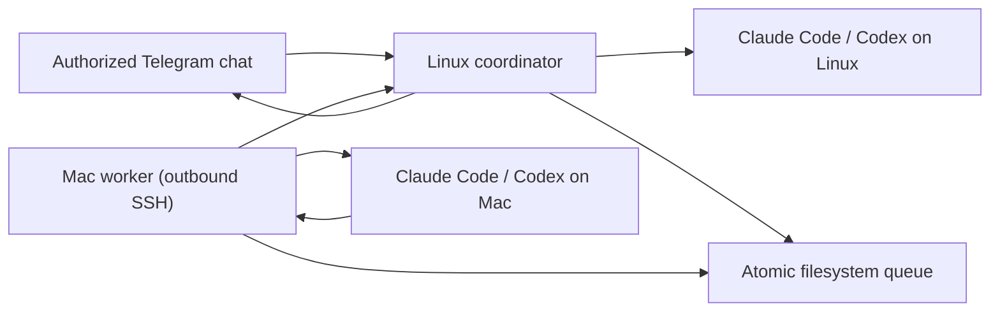

# Telegram bridge for Claude Code and Codex

A private Telegram control plane for Claude Code and Codex across an always-on Linux machine and a Mac, built into stackhour as the `stackhour bridge` subcommand.

The Linux coordinator owns the Telegram connection and can run either agent locally. The Mac worker polls the coordinator over outbound SSH, runs work locally, and returns the result. The Mac needs no open port and jobs remain queued while it sleeps.

## What it supports

- Claude Code and Codex with independent sessions per machine
- Linux and Mac target switching from Telegram
- Text, image, video, audio, and optional ElevenLabs voice transcription
- Inline controls, live tool status, cancellation, and rich responses
- Outbound-only Mac connectivity
- A single authorized Telegram chat ID
- Automatic systemd and launchd installation
- Configuration backups, upgrades, and a built-in health check
- No runtime npm dependencies

## Architecture



## Prerequisites

Install Node.js 22 or newer, Claude Code, and Codex on both machines. Authenticate both coding agents before installing the bridge.

You also need:

- a Telegram bot token
- the numeric ID of the one Telegram chat allowed to use it
- SSH key authentication from the Mac to the Linux machine
- optional: an ElevenLabs API key for voice transcription

## Install

Install the coordinator first, on the always-on Linux machine:

```sh
git clone https://github.com/NikitaVoitik/stackhour.git ~/stackhour
cd ~/stackhour
./bin/stackhour bridge install coordinator
```

The setup wizard masks secrets, detects the installed agent binaries, writes a mode-`600` config, installs the runtime under `~/.local/share/stackhour/bridge`, generates a user-level systemd service, enables it, and starts it.

Then install the worker on the Mac:

```sh
git clone https://github.com/NikitaVoitik/stackhour.git ~/stackhour
cd ~/stackhour
./bin/stackhour bridge install worker
```

The Mac wizard verifies the SSH key and local agent paths, installs the runtime, generates and validates a LaunchAgent, and starts it.

Run the end-to-end health check on each machine:

```sh
stackhour bridge doctor coordinator
stackhour bridge doctor worker
```

The worker doctor also verifies SSH connectivity and confirms that the remote queue helpers are installed.

## What the installer changes

The installer only writes inside the current user's home directory:

- `~/.local/share/stackhour/bridge/` — runtime, private config, queue data, media, and logs
- Linux: `~/.config/systemd/user/stackhour-bridge.service`
- macOS: `~/Library/LaunchAgents/com.stackhour.bridge-worker.plist`

It does not install npm dependencies or require root. On Linux, it may recommend one explicit `sudo loginctl enable-linger <user>` command so the user service remains alive after logout.

Re-running the installer upgrades the runtime and keeps the existing config. Use `--reconfigure` to replace configuration; the previous file is backed up first.

```sh
git pull
./bin/stackhour bridge install coordinator
./bin/stackhour bridge install worker
```

Use another runtime location with `--runtime-dir` or `STACKHOUR_BRIDGE_HOME`.

## Non-interactive installation

Use `--non-interactive` in automation. Coordinator variables:

| Variable | Required | Purpose |
| --- | --- | --- |
| `TELEGRAM_BOT_TOKEN` | yes | Telegram bot token |
| `TELEGRAM_CHAT_ID` | yes | Only authorized chat ID |
| `BRIDGE_WORKDIR` | yes | Agent working directory |
| `CLAUDE_BIN` | yes | Claude Code executable |
| `CODEX_BIN` | yes | Codex executable |
| `BRIDGE_PERMISSION_MODE` | no | `default` or `bypassPermissions` |
| `ELEVENLABS_API_KEY` | no | Voice transcription |
| `STACKHOUR_BRIDGE_HOME` | no | Runtime directory |

Worker variables:

| Variable | Required | Purpose |
| --- | --- | --- |
| `BRIDGE_GCP_SSH` | yes | Linux destination in `user@host` form |
| `BRIDGE_GCP_KEY` | yes | SSH private key |
| `BRIDGE_REMOTE_DIR` | yes | Coordinator runtime directory |
| `BRIDGE_REMOTE_NODE` | yes | Node.js executable on Linux |
| `BRIDGE_WORKDIR` | yes | Mac agent working directory |
| `CLAUDE_BIN` | yes | Claude Code executable |
| `CODEX_BIN` | yes | Codex executable |
| `BRIDGE_PERMISSION_MODE` | no | `default` or `bypassPermissions` |
| `STACKHOUR_BRIDGE_HOME` | no | Runtime directory |

Example:

```sh
TELEGRAM_BOT_TOKEN="..." \
TELEGRAM_CHAT_ID="123456789" \
BRIDGE_WORKDIR="$HOME/workspace" \
CLAUDE_BIN="$(command -v claude)" \
CODEX_BIN="$(command -v codex)" \
./bin/stackhour bridge install coordinator --non-interactive
```

## Operations

```sh
stackhour bridge status coordinator
stackhour bridge restart coordinator
stackhour bridge status worker
stackhour bridge restart worker
```

Telegram commands:

- `/claude` and `/codex` select the engine.
- `/mac` and `/gcp` select the target.
- `/where` shows the active target, engine, session, and worker status.
- `/new` starts a clean session for the selected engine and target.
- `/stop` stops Linux work or cancels Mac jobs that have not been claimed.
- `/menu` opens inline controls.

Send a one-off notification through the installed coordinator:

```sh
node ~/.local/share/stackhour/bridge/tg-send.mjs --from "GCP" "deployment finished"
```

## Configuration directory

The bridge can be extended without touching code, through an optional
configuration directory. **Everything in it is optional.** With no
configuration directory at all — the default state — the bridge behaves
exactly as documented above; the shipped commands, engines and prompt
templates are compiled into the binary.

The root is `dirname($STACKHOUR_CONFIG)`, i.e. `~/.config/stackhour/` by
default, and can be pointed elsewhere with `STACKHOUR_CONFIG_DIR`.

```
~/.config/stackhour/
  config.json            # the legacy settings file; unchanged
  commands/<name>.toml   # one file per command; the stem is the verb
  skills/<name>/         # skill.toml + skill.md
  agents/<name>/         # agent.toml + soul.md (+ overlays)
  engines/<name>.toml    # extra CLI engines; claude and codex ship built in
  prompts/<name>.md      # override a shipped template, or define a new one
```

Write a starter tree — a complete, commented, working example — with:

```sh
stackhour bridge init --config-dir
```

It never overwrites a file that already exists, so it is safe to re-run.

### Discovery

- Flat entities (`commands/`, `engines/`, `prompts/`) are one file per entity
  and the **file stem is the name**. Composite entities (`agents/`, `skills/`)
  are one **directory** per entity, named by the directory, containing a
  manifest (`agent.toml` / `skill.toml`) plus its markdown documents.
- Dot-prefixed files and directories are ignored everywhere, so editor scratch
  files and `.git` never load.
- Entries are processed in sorted name order, so `/help`, the keyboard and the
  `setMyCommands` payload are deterministic.
- A missing top-level subdirectory is silent and simply means "built-ins only".
  A subdirectory missing its manifest is reported by name and skipped.

### Layering

Four layers, lowest precedence first:

1. **Embedded defaults** compiled into the binary — the shipped commands, the
   `claude` and `codex` engines, and the shipped prompt templates.
2. **`config.json`**, specifically its optional `"bridge"` object. Scalar
   defaults only; it never defines entities. The Node implementation ignores
   the key, so adding it does not break a mixed deployment.
3. **The configuration directory** described above.
4. **Environment variables**, highest precedence.

```json
{
  "token": "…",
  "bridge": {
    "defaultAgent": "reviewer",
    "defaultEngine": "claude",
    "defaultTarget": "gcp"
  }
}
```

| Variable | Effect |
| --- | --- |
| `STACKHOUR_CONFIG_DIR` | registry root |
| `STACKHOUR_AGENT` | default agent name |
| `STACKHOUR_ENGINE` | default engine name |
| `STACKHOUR_TARGET` | default target (`gcp` or `mac`) |

An empty or whitespace-only variable falls through to the layer below, matching
the `env.X || default` convention used everywhere else in stackhour.

Merging is **entity-level replacement by name**, not field-level merge: a file
at `engines/claude.toml` replaces the built-in `claude` wholesale. The replaced
entity keeps its position, so an overridden command stays in the same slot in
`/help` and the keyboard. The one exception is an agent's `extends`, which is
field-level inheritance the user asked for explicitly in the file itself.

### Validation

A file that fails to parse or validate is **skipped, never fatal**. The bridge
keeps running on the rest of the configuration and the reason is reported by
`stackhour bridge doctor`, always naming the file and the key:

```
agents/reviewer/agent.toml: key `engine`: references unknown engine 'gpt5' (known: claude, codex)
commands/deploy.toml: key `args[0].name`: is required and must be a non-empty string
```

Cross-references are checked after loading and every broken one is reported
(not just the first), then the offending entity is dropped: command → agent,
engine, skill, prompt template and sequence steps; skill → agent, prompt
template, skills; agent → engine, skills, parent agent, prompt template.

Composition graphs — agents via `extends`, skills via `uses`, commands via
`steps` — are checked for cycles. A cycle is reported once, naming the full
path (`agents: cycle a -> b -> a`), and every entity on the cycle is dropped.
A composition chain deeper than 16 levels is refused for the same reason.

### Reload

Configuration changes take effect without a restart.

- **Prose** — `soul.md`, `skill.md`, `prompts/*.md` — is re-read whenever its
  mtime changes, checked on every use. Editing a soul takes effect on the very
  next message, with no reload at all.
- **Structure** — adding, removing or renaming an entity file — is detected by
  re-stat'ing the five subdirectories plus `config.json` before each Telegram
  update is dispatched. Any change rebuilds the whole registry.

A reload never disturbs a running job: a job takes an immutable snapshot of the
registry when it spawns and keeps reading that snapshot until it finishes, even
if the underlying files are edited or deleted meanwhile.

Newly appeared validation errors are logged once by the coordinator rather than
on every update; `stackhour bridge doctor` always prints the full current set.

### Commands

`commands/<name>.toml` defines one Telegram verb; the file stem is the verb, so
`commands/deploy.toml` is `/deploy`. Names follow Telegram's own rule: 1–32
characters of lowercase letters, digits and underscores.

There is exactly **one** command table — the commands shipped with the binary,
with any user file of the same name substituted in place, followed by the
remaining user commands. The `setMyCommands` registration, the `/help` body and
the inline keyboard are all generated from that table. There is no second copy
of the command list anywhere.

| Key | Type | Default | Meaning |
| --- | --- | --- | --- |
| `description` | string | — (required) | Shown by `setMyCommands` and in `/help`. |
| `kind` | enum | — (required) | The action; see below. |
| `aliases` | \[string] | `[]` | Extra verbs that dispatch here. Not registered with Telegram separately, so they stay out of autocomplete — exactly like `/local` and `/remote` today. |
| `hidden` | bool | `false` | Registered, but omitted from `/help` and the keyboard. |
| `keyboard` | bool | `false` | Also render as an inline button in `/menu`. |
| `button` | string | `description` | Button caption when `keyboard = true`. |
| `button_order` | integer | table position | Keyboard sort key. Buttons are laid out two per row in this order. |
| `confirm` | bool | `false` | Show an inline Yes/Cancel keyboard before running. |
| `[[args]]` | array of tables | `[]` | Positional arguments; see below. |

#### Kinds

| `kind` | Required key | Action |
| --- | --- | --- |
| `prompt` | `template` | Render that prompt template with the bound arguments and route the result exactly like typed text. |
| `agent` | `agent` | Switch the active named agent. |
| `engine` | `engine` | Switch the active engine. |
| `target` | `target` | Switch the active target (`gcp` or `mac`). |
| `shell` | `argv` | Run a fixed argv and reply with its output. |
| `skill` | `skill` | Invoke a named skill with the bound arguments. |
| `sequence` | `steps` | Run other commands in order, aborting on the first failure. |

Any kind may also set `agent` and/or `target` as a **pre-switch** applied before
the action runs. All of these names are cross-referenced at load time and a
command with a broken reference is dropped with a message naming the key.

`steps` names other commands and is cycle-checked with the same detector used
for agent `extends` and skill `uses`; a command may not list itself, may not
list more than 16 steps, and any cycle drops every command on it.

#### `kind = "shell"` never touches a shell

`argv` is exec'd literally. There is no `sh -c`, no word splitting of user
input, and no quoting for you to get wrong:

```toml
description = "Show host load and disk"
kind        = "shell"
argv        = ["df", "-h", "/"]
```

How the user's words reach the process depends on whether the command declares
arguments:

- **No `[[args]]`** — the trimmed argument string is appended as **one** final
  argv element, verbatim. `/disk ; rm -rf /` passes the literal string
  `; rm -rf /` as a single argument; nothing interprets it.
- **With `[[args]]`** — each fixed argv element gets `{{name}}` substituted per
  element, then any argument the template did not reference is appended as its
  **own separate element** in declaration order, skipping empty values. This is
  a deliberate change from the single trailing blob, which is why an argument
  spec is opt-in.

```toml
argv = ["./deploy.sh", "--env", "{{env}}"]
# /deploy prod hurry up  ->  ["./deploy.sh", "--env", "prod", "hurry up"]
```

#### Overriding a shipped command

Only `/start`, `/help`, `/menu` and `/stop` are reserved — the bridge cannot
recover if those break. **Every other shipped verb can now be redefined by a
user file of the same name**, including `/claude`, `/codex`, `/mac`, `/gcp`,
`/where` and `/new`. This is a behavioural change from the Node bridge, where
all fourteen verbs were unshadowable.

An override keeps the slot it replaced, so `/help`, the keyboard and the
Telegram command list stay in the same order. A command **name** always wins
over an **alias**: a user file called `commands/status.toml` quietly takes
`/status` from the shipped `/where` alias. Two aliases claiming the same verb
is an error, since neither can win.

#### Generated help

`/help` renders the `help` prompt template. Drop a `prompts/help.md` containing
a `{{commands}}` placeholder and the whole body is generated from the table:

```markdown
<b>My bridge</b>

{{commands}}

<i>Anything else goes to the active engine.</i>
```

The shipped `help` template has no placeholder — it is still the Node bridge's
exact HTML — so an unconfigured bridge prints byte-identical help, and any user
commands are simply appended to it.

### A worked example

`~/.config/stackhour/commands/deploy.toml` — a prompt command with named
arguments, a confirmation step and a menu button:

```toml
description = "Run the deploy checklist"
aliases     = ["ship"]
confirm     = true
keyboard    = true
button      = "🚀 Deploy"

kind     = "prompt"
template = "deploy"          # -> prompts/deploy.md

[[args]]
name        = "env"
required    = true
choices     = ["staging", "prod"]
description = "which environment to deploy"

[[args]]
name        = "note"
rest        = true           # swallows the rest of the line, verbatim
description = "anything extra to tell the agent"
```

`~/.config/stackhour/prompts/deploy.md`:

```markdown
Deploy to **{{env}}**.

1. Confirm the working tree is clean and on the expected branch.
2. Run the test suite. Do not continue on a failure.
3. Deploy to {{env}}.
4. Verify by hitting the health endpoint, not by reading logs.

Extra instructions from the operator: {{note}}
```

Then `/deploy prod rebuild the image first` binds `env = "prod"` and
`note = "rebuild the image first"`, renders the template, and asks for
confirmation before sending it to the active engine. `{{args}}` — the raw,
untouched argument string — remains available in every template regardless of
the argument spec.

Arguments bind positionally on whitespace. A `rest` argument must be last and
takes the remainder of the line including internal whitespace. Optional
arguments that were not supplied get their `default`, so a template never leaks
an unsubstituted `{{placeholder}}`.

### Skills

A skill is a **capability pack** in `skills/<name>/`: prose that goes into the
system prompt, an argument schema, a prompt template, a tool/permission policy,
a default agent, and pre/post hooks. The point is that a repeatable task should
be a file you edit, not a paragraph you retype.

A skill can be invoked three ways, and all three resolve identically:

- from a command with `kind = "skill"`,
- from another skill's `uses` list,
- from an agent's `skills` list — which contributes the prose and policy only,
  binding no arguments and running no hooks, because listing a skill is not
  invoking it.

`skills/<name>/skill.toml`. Only `description` is required, and every default
reproduces the pre-skills behaviour exactly:

| Key | Default | Meaning |
| --- | --- | --- |
| `description` | — | required, non-empty; shown wherever the skill is listed |
| `body` | `"skill.md"` | markdown appended to the system prompt; hot-reloaded by mtime |
| `agent` | none | default agent for this skill; cross-ref checked |
| `template` | none | prompt template rendered with the bound args to form the user prompt; absent = the raw argument string, verbatim |
| `uses` | `[]` | skills composed into this one; cycle-detected |
| `[[args]]` | `[]` | the same `ArgSpec` as commands |
| `[tools]` | empty | `allow` / `deny` merged into the engine spawn |
| `[env]` | empty | env vars merged into the spawn |
| `[hooks]` | none | `pre` / `post` fixed argv, `timeout_seconds` (default 60) |

#### Composition

`uses` pulls other skills in. Bodies are concatenated **dependency-first** —
the general advice before the specialisation that refines it — deduped by name,
so a skill reached by two paths appears once at its earliest position. Tool
policies and env are merged in the same order, so the invoked skill's own
settings win. Tool merging is a union in which **deny always wins**: composing
a skill can only ever tighten the policy, never loosen it.

Arguments bind against the **invoked** skill's spec only. A composed skill
contributes prose and policy, not arity — otherwise adding a `uses` entry would
silently change how the user has to type the command.

Cycles are detected at load, reported once naming the full path, and every
skill on the cycle is dropped. Composition deeper than 16 levels is refused.

#### Hooks never touch a shell

`pre` and `post` are **fixed argv**, exactly like `kind = "shell"` commands.
They go straight to `execve`; there is no shell, no word splitting and no
quoting to get wrong. Placeholders are substituted **per argv element** —
`{{arg:<name>}}`, `{{skill}}`, `{{agent}}`, `{{cwd}}` — and one element always
produces exactly one argument, so a value of `; rm -rf /` is inert data. An
unknown placeholder is left verbatim rather than becoming an empty argument, so
a typo is visible instead of silent.

A `pre` hook exiting non-zero **aborts the turn** and its stderr is sent to the
chat. A `post` hook exiting non-zero is logged only — the turn already
happened. Either hook exceeding `timeout_seconds` is killed and reported. Hooks
run in the selected agent's `cwd` when it declares one, and see the skill's
`[env]`.

#### A worked example

`~/.config/stackhour/skills/git-hygiene/skill.toml` — a small shared skill that
other skills compose in:

```toml
description = "House rules for touching a git repository"

[tools]
deny = ["WebSearch"]
```

`~/.config/stackhour/skills/git-hygiene/skill.md`:

```markdown
Never commit on `master`; branch first. Never use `git checkout .`,
`git reset --hard` or `git clean` on files you did not create in this task.
Commit messages describe what changed and why, in the imperative.
```

`~/.config/stackhour/skills/review/skill.toml` — the realistic one:

```toml
description = "Careful code review with a fixed rubric"
agent       = "reviewer"       # switch to agents/reviewer/ for this turn
template    = "review"         # -> prompts/review.md
uses        = ["git-hygiene"]  # its body is prepended, its deny inherited

[[args]]
name        = "path"
required    = true
description = "file or directory to review"

[[args]]
name        = "focus"
rest        = true
default     = "correctness and error handling"
description = "what to pay attention to"

[tools]
allow = ["Read", "Grep", "Glob", "Bash"]
deny  = ["Write", "Edit"]

[env]
REVIEW_STRICT = "1"

[hooks]
pre  = ["git", "diff", "--quiet", "--exit-code", "--", "{{arg:path}}"]
post = ["git", "status", "--short"]
timeout_seconds = 30
```

`~/.config/stackhour/prompts/review.md`:

```markdown
Review `{{path}}`, paying particular attention to {{focus}}.

Quote the exact line for each finding. Do not say "looks good" without naming
what you checked.
```

`~/.config/stackhour/commands/review.toml`:

```toml
description = "Review a path with the review skill"
aliases     = ["rv"]
kind        = "skill"
skill       = "review"
```

Then `/review src/api the error paths`:

1. binds `path = "src/api"` and `focus = "the error paths"`;
2. runs the `pre` hook — `git diff --quiet -- src/api`. If the path has
   uncommitted changes the hook exits non-zero, the turn is **aborted**, and
   the chat gets the hook's stderr;
3. composes the system prompt from `git-hygiene`'s body then `review`'s;
4. spawns the `reviewer` agent with `WebSearch`, `Write` and `Edit` denied and
   `REVIEW_STRICT=1` set;
5. sends the rendered `prompts/review.md` as the user prompt;
6. runs the `post` hook, logging but not surfacing a failure.

A skill with no `template` sends the raw argument string exactly as typed,
which is what a skill with only a `description` has always done.

Errors name the file and the key like everything else in the registry:

```
skills/review/skill.toml: key `hooks.pre`: argv entries must be non-empty strings
skills/review/skill.toml: key `args[0].rest`: only the LAST argument may set rest = true ('path' is followed by 'focus')
skills/review/skill.toml: key `uses`: skill 'review' cannot use itself
```

and an invocation error is answered in the chat, naming the argument:

```
/review: key `path`: missing required argument 'path' (file or directory to review)
```

## Security

This is intentionally a remote-execution bridge. Protect the Telegram account, bot token, SSH key, and agent credentials as privileged access.

The installer defaults to normal approval and sandbox behavior. Selecting `bypassPermissions` allows Telegram prompts to bypass normal safeguards and should only be used when that risk is explicitly accepted.

See [SECURITY.md](../SECURITY.md) for the complete security model.
