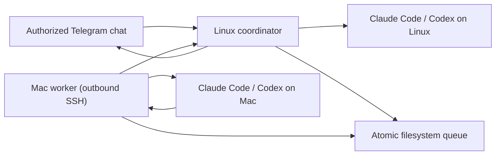

# Telegram bridge for Claude Code and Codex

A private Telegram control plane for Claude Code and Codex across an always-on Linux machine and a Mac, built into stackhour as the `stackhour bridge` subcommand.

The Linux coordinator owns the Telegram connection and can run either agent locally. The Mac worker polls the coordinator over outbound SSH, runs work locally, and returns the result. The Mac needs no open port and jobs remain queued while it sleeps.

## What it supports

- Claude Code and Codex with independent sessions per machine
- Linux and Mac target switching from Telegram
- Text, image, video, audio, and optional ElevenLabs voice transcription
- Inline controls, live tool status, cancellation, and rich responses
- Outbound-only Mac connectivity
- A single authorized Telegram chat ID
- Automatic systemd and launchd installation
- Configuration backups, upgrades, and a built-in health check
- No runtime npm dependencies

## Architecture



## Prerequisites

Install Node.js 22 or newer, Claude Code, and Codex on both machines. Authenticate both coding agents before installing the bridge.

You also need:

- a Telegram bot token
- the numeric ID of the one Telegram chat allowed to use it
- SSH key authentication from the Mac to the Linux machine
- optional: an ElevenLabs API key for voice transcription

## Install

Install the coordinator first, on the always-on Linux machine:

```sh
git clone https://github.com/NikitaVoitik/stackhour.git ~/stackhour
cd ~/stackhour
./bin/stackhour bridge install coordinator
```

The setup wizard masks secrets, detects the installed agent binaries, writes a mode-`600` config, installs the runtime under `~/.local/share/stackhour/bridge`, generates a user-level systemd service, enables it, and starts it.

Then install the worker on the Mac:

```sh
git clone https://github.com/NikitaVoitik/stackhour.git ~/stackhour
cd ~/stackhour
./bin/stackhour bridge install worker
```

The Mac wizard verifies the SSH key and local agent paths, installs the runtime, generates and validates a LaunchAgent, and starts it.

Run the end-to-end health check on each machine:

```sh
stackhour bridge doctor coordinator
stackhour bridge doctor worker
```

The worker doctor also verifies SSH connectivity and confirms that the remote queue helpers are installed.

## What the installer changes

The installer only writes inside the current user's home directory:

- `~/.local/share/stackhour/bridge/` — runtime, private config, queue data, media, and logs
- Linux: `~/.config/systemd/user/stackhour-bridge.service`
- macOS: `~/Library/LaunchAgents/com.stackhour.bridge-worker.plist`

It does not install npm dependencies or require root. On Linux, it may recommend one explicit `sudo loginctl enable-linger <user>` command so the user service remains alive after logout.

Re-running the installer upgrades the runtime and keeps the existing config. Use `--reconfigure` to replace configuration; the previous file is backed up first.

```sh
git pull
./bin/stackhour bridge install coordinator
./bin/stackhour bridge install worker
```

Use another runtime location with `--runtime-dir` or `STACKHOUR_BRIDGE_HOME`.

## Non-interactive installation

Use `--non-interactive` in automation. Coordinator variables:

| Variable | Required | Purpose |
| --- | --- | --- |
| `TELEGRAM_BOT_TOKEN` | yes | Telegram bot token |
| `TELEGRAM_CHAT_ID` | yes | Only authorized chat ID |
| `BRIDGE_WORKDIR` | yes | Agent working directory |
| `CLAUDE_BIN` | yes | Claude Code executable |
| `CODEX_BIN` | yes | Codex executable |
| `BRIDGE_PERMISSION_MODE` | no | `default` or `bypassPermissions` |
| `ELEVENLABS_API_KEY` | no | Voice transcription |
| `STACKHOUR_BRIDGE_HOME` | no | Runtime directory |

Worker variables:

| Variable | Required | Purpose |
| --- | --- | --- |
| `BRIDGE_GCP_SSH` | yes | Linux destination in `user@host` form |
| `BRIDGE_GCP_KEY` | yes | SSH private key |
| `BRIDGE_REMOTE_DIR` | yes | Coordinator runtime directory |
| `BRIDGE_REMOTE_NODE` | yes | Node.js executable on Linux |
| `BRIDGE_WORKDIR` | yes | Mac agent working directory |
| `CLAUDE_BIN` | yes | Claude Code executable |
| `CODEX_BIN` | yes | Codex executable |
| `BRIDGE_PERMISSION_MODE` | no | `default` or `bypassPermissions` |
| `STACKHOUR_BRIDGE_HOME` | no | Runtime directory |

Example:

```sh
TELEGRAM_BOT_TOKEN="..." \
TELEGRAM_CHAT_ID="123456789" \
BRIDGE_WORKDIR="$HOME/workspace" \
CLAUDE_BIN="$(command -v claude)" \
CODEX_BIN="$(command -v codex)" \
./bin/stackhour bridge install coordinator --non-interactive
```

## Operations

```sh
stackhour bridge status coordinator
stackhour bridge restart coordinator
stackhour bridge status worker
stackhour bridge restart worker
```

Telegram commands:

- `/claude` and `/codex` select the engine.
- `/mac` and `/gcp` select the target.
- `/where` shows the active target, engine, session, and worker status.
- `/new` starts a clean session for the selected engine and target.
- `/stop` stops Linux work or cancels Mac jobs that have not been claimed.
- `/menu` opens inline controls.

Send a one-off notification through the installed coordinator:

```sh
node ~/.local/share/stackhour/bridge/tg-send.mjs --from "GCP" "deployment finished"
```

## Configuration directory

The bridge can be extended without touching code, through an optional
configuration directory. **Everything in it is optional.** With no
configuration directory at all — the default state — the bridge behaves
exactly as documented above; the shipped commands, engines and prompt
templates are compiled into the binary.

The root is `dirname($STACKHOUR_CONFIG)`, i.e. `~/.config/stackhour/` by
default, and can be pointed elsewhere with `STACKHOUR_CONFIG_DIR`.

```
~/.config/stackhour/
  config.json            # the legacy settings file; unchanged
  commands/<name>.toml   # one file per command; the stem is the verb
  skills/<name>/         # skill.toml + skill.md
  agents/<name>/         # agent.toml + soul.md (+ overlays)
  engines/<name>.toml    # extra CLI engines; claude and codex ship built in
  prompts/<name>.md      # override a shipped template, or define a new one
```

Write a starter tree — a complete, commented, working example — with:

```sh
stackhour bridge init --config-dir
```

It never overwrites a file that already exists, so it is safe to re-run.

### Discovery

- Flat entities (`commands/`, `engines/`, `prompts/`) are one file per entity
  and the **file stem is the name**. Composite entities (`agents/`, `skills/`)
  are one **directory** per entity, named by the directory, containing a
  manifest (`agent.toml` / `skill.toml`) plus its markdown documents.
- Dot-prefixed files and directories are ignored everywhere, so editor scratch
  files and `.git` never load.
- Entries are processed in sorted name order, so `/help`, the keyboard and the
  `setMyCommands` payload are deterministic.
- A missing top-level subdirectory is silent and simply means "built-ins only".
  A subdirectory missing its manifest is reported by name and skipped.

### Layering

Four layers, lowest precedence first:

1. **Embedded defaults** compiled into the binary — the shipped commands, the
   `claude` and `codex` engines, and the shipped prompt templates.
2. **`config.json`**, specifically its optional `"bridge"` object. Scalar
   defaults only; it never defines entities. The Node implementation ignores
   the key, so adding it does not break a mixed deployment.
3. **The configuration directory** described above.
4. **Environment variables**, highest precedence.

```json
{
  "token": "…",
  "bridge": {
    "defaultAgent": "reviewer",
    "defaultEngine": "claude",
    "defaultTarget": "gcp"
  }
}
```

| Variable | Effect |
| --- | --- |
| `STACKHOUR_CONFIG_DIR` | registry root |
| `STACKHOUR_AGENT` | default agent name |
| `STACKHOUR_ENGINE` | default engine name |
| `STACKHOUR_TARGET` | default target (`gcp` or `mac`) |

An empty or whitespace-only variable falls through to the layer below, matching
the `env.X || default` convention used everywhere else in stackhour.

Merging is **entity-level replacement by name**, not field-level merge: a file
at `engines/claude.toml` replaces the built-in `claude` wholesale. The replaced
entity keeps its position, so an overridden command stays in the same slot in
`/help` and the keyboard. The one exception is an agent's `extends`, which is
field-level inheritance the user asked for explicitly in the file itself.

### Validation

A file that fails to parse or validate is **skipped, never fatal**. The bridge
keeps running on the rest of the configuration and the reason is reported by
`stackhour bridge doctor`, always naming the file and the key:

```
agents/reviewer/agent.toml: key `engine`: references unknown engine 'gpt5' (known: claude, codex)
commands/deploy.toml: key `args[0].name`: is required and must be a non-empty string
```

Cross-references are checked after loading and every broken one is reported
(not just the first), then the offending entity is dropped: command → agent,
engine, skill, prompt template and sequence steps; skill → agent, prompt
template, skills; agent → engine, skills, parent agent, prompt template.

Composition graphs — agents via `extends`, skills via `uses`, commands via
`steps` — are checked for cycles. A cycle is reported once, naming the full
path (`agents: cycle a -> b -> a`), and every entity on the cycle is dropped.
A composition chain deeper than 16 levels is refused for the same reason.

### Reload

Configuration changes take effect without a restart.

- **Prose** — `soul.md`, `skill.md`, `prompts/*.md` — is re-read whenever its
  mtime changes, checked on every use. Editing a soul takes effect on the very
  next message, with no reload at all.
- **Structure** — adding, removing or renaming an entity file — is detected by
  re-stat'ing the five subdirectories plus `config.json` before each Telegram
  update is dispatched. Any change rebuilds the whole registry.

A reload never disturbs a running job: a job takes an immutable snapshot of the
registry when it spawns and keeps reading that snapshot until it finishes, even
if the underlying files are edited or deleted meanwhile.

Newly appeared validation errors are logged once by the coordinator rather than
on every update; `stackhour bridge doctor` always prints the full current set.

### A worked example

`~/.config/stackhour/commands/deploy.toml` — a prompt command with named
arguments, a confirmation step and a menu button:

```toml
description = "Run the deploy checklist"
aliases     = ["ship"]
confirm     = true
keyboard    = true
button      = "🚀 Deploy"

kind     = "prompt"
template = "deploy"          # -> prompts/deploy.md

[[args]]
name        = "env"
required    = true
choices     = ["staging", "prod"]
description = "which environment to deploy"

[[args]]
name        = "note"
rest        = true           # swallows the rest of the line, verbatim
description = "anything extra to tell the agent"
```

`~/.config/stackhour/prompts/deploy.md`:

```markdown
Deploy to **{{env}}**.

1. Confirm the working tree is clean and on the expected branch.
2. Run the test suite. Do not continue on a failure.
3. Deploy to {{env}}.
4. Verify by hitting the health endpoint, not by reading logs.

Extra instructions from the operator: {{note}}
```

Then `/deploy prod rebuild the image first` binds `env = "prod"` and
`note = "rebuild the image first"`, renders the template, and asks for
confirmation before sending it to the active engine. `{{args}}` — the raw,
untouched argument string — remains available in every template regardless of
the argument spec.

Arguments bind positionally on whitespace. A `rest` argument must be last and
takes the remainder of the line including internal whitespace. Optional
arguments that were not supplied get their `default`, so a template never leaks
an unsubstituted `{{placeholder}}`.

## Security

This is intentionally a remote-execution bridge. Protect the Telegram account, bot token, SSH key, and agent credentials as privileged access.

The installer defaults to normal approval and sandbox behavior. Selecting `bypassPermissions` allows Telegram prompts to bypass normal safeguards and should only be used when that risk is explicitly accepted.

See [SECURITY.md](../SECURITY.md) for the complete security model.
