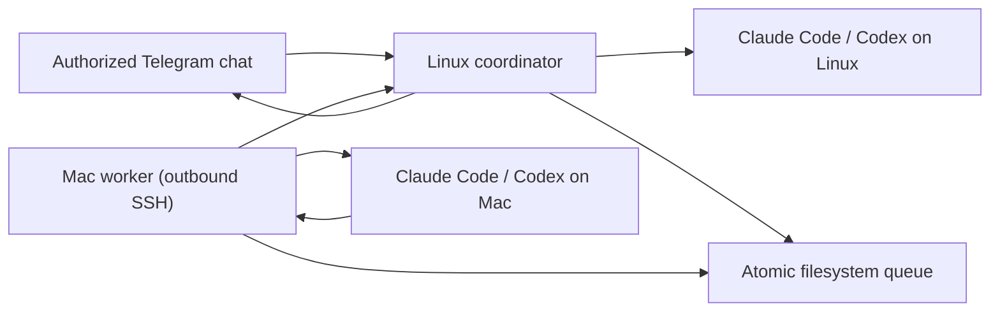

# Telegram bridge for Claude Code and Codex

A private Telegram control plane for Claude Code and Codex across an always-on Linux machine and a Mac, built into stackhour as the `stackhour bridge` subcommand.

The Linux coordinator owns the Telegram connection and can run either agent locally. The Mac worker polls the coordinator over outbound SSH, runs work locally, and returns the result. The Mac needs no open port and jobs remain queued while it sleeps.

## What it supports

- Claude Code and Codex with independent sessions per machine
- Linux and Mac target switching from Telegram
- Text, image, video, audio, and optional ElevenLabs voice transcription
- Inline controls, live tool status, cancellation, and rich responses
- Outbound-only Mac connectivity
- A single authorized Telegram chat ID
- Automatic systemd and launchd installation
- Configuration backups, upgrades, and a built-in health check
- No runtime npm dependencies

## Architecture



## Prerequisites

Install Node.js 22 or newer, Claude Code, and Codex on both machines. Authenticate both coding agents before installing the bridge.

You also need:

- a Telegram bot token
- the numeric ID of the one Telegram chat allowed to use it
- SSH key authentication from the Mac to the Linux machine
- optional: an ElevenLabs API key for voice transcription

## Install

Install the coordinator first, on the always-on Linux machine:

```sh
git clone https://github.com/NikitaVoitik/stackhour.git ~/stackhour
cd ~/stackhour
./bin/stackhour bridge install coordinator
```

The setup wizard masks secrets, detects the installed agent binaries, writes a mode-`600` config, installs the runtime under `~/.local/share/stackhour/bridge`, generates a user-level systemd service, enables it, and starts it.

Then install the worker on the Mac:

```sh
git clone https://github.com/NikitaVoitik/stackhour.git ~/stackhour
cd ~/stackhour
./bin/stackhour bridge install worker
```

The Mac wizard verifies the SSH key and local agent paths, installs the runtime, generates and validates a LaunchAgent, and starts it.

Run the end-to-end health check on each machine:

```sh
stackhour bridge doctor coordinator
stackhour bridge doctor worker
```

The worker doctor also verifies SSH connectivity and confirms that the remote queue helpers are installed.

## What the installer changes

The installer only writes inside the current user's home directory:

- `~/.local/share/stackhour/bridge/` — runtime, private config, queue data, media, and logs
- Linux: `~/.config/systemd/user/stackhour-bridge.service`
- macOS: `~/Library/LaunchAgents/com.stackhour.bridge-worker.plist`

It does not install npm dependencies or require root. On Linux, it may recommend one explicit `sudo loginctl enable-linger <user>` command so the user service remains alive after logout.

Re-running the installer upgrades the runtime and keeps the existing config. Use `--reconfigure` to replace configuration; the previous file is backed up first.

```sh
git pull
./bin/stackhour bridge install coordinator
./bin/stackhour bridge install worker
```

Use another runtime location with `--runtime-dir` or `STACKHOUR_BRIDGE_HOME`.

## Non-interactive installation

Use `--non-interactive` in automation. Coordinator variables:

| Variable | Required | Purpose |
| --- | --- | --- |
| `TELEGRAM_BOT_TOKEN` | yes | Telegram bot token |
| `TELEGRAM_CHAT_ID` | yes | Only authorized chat ID |
| `BRIDGE_WORKDIR` | yes | Agent working directory |
| `CLAUDE_BIN` | yes | Claude Code executable |
| `CODEX_BIN` | yes | Codex executable |
| `BRIDGE_PERMISSION_MODE` | no | `default` or `bypassPermissions` |
| `ELEVENLABS_API_KEY` | no | Voice transcription |
| `STACKHOUR_BRIDGE_HOME` | no | Runtime directory |

Worker variables:

| Variable | Required | Purpose |
| --- | --- | --- |
| `BRIDGE_GCP_SSH` | yes | Linux destination in `user@host` form |
| `BRIDGE_GCP_KEY` | yes | SSH private key |
| `BRIDGE_REMOTE_DIR` | yes | Coordinator runtime directory |
| `BRIDGE_REMOTE_NODE` | yes | Node.js executable on Linux |
| `BRIDGE_WORKDIR` | yes | Mac agent working directory |
| `CLAUDE_BIN` | yes | Claude Code executable |
| `CODEX_BIN` | yes | Codex executable |
| `BRIDGE_PERMISSION_MODE` | no | `default` or `bypassPermissions` |
| `STACKHOUR_BRIDGE_HOME` | no | Runtime directory |

Example:

```sh
TELEGRAM_BOT_TOKEN="..." \
TELEGRAM_CHAT_ID="123456789" \
BRIDGE_WORKDIR="$HOME/workspace" \
CLAUDE_BIN="$(command -v claude)" \
CODEX_BIN="$(command -v codex)" \
./bin/stackhour bridge install coordinator --non-interactive
```

## Operations

```sh
stackhour bridge status coordinator
stackhour bridge restart coordinator
stackhour bridge status worker
stackhour bridge restart worker
```

Telegram commands:

- `/claude` and `/codex` select the engine.
- `/mac` and `/gcp` select the target.
- `/where` shows the active target, engine, session, and worker status.
- `/new` starts a clean session for the selected engine and target.
- `/stop` stops Linux work or cancels Mac jobs that have not been claimed.
- `/menu` opens inline controls.

Send a one-off notification through the installed coordinator:

```sh
node ~/.local/share/stackhour/bridge/tg-send.mjs --from "GCP" "deployment finished"
```

## Security

This is intentionally a remote-execution bridge. Protect the Telegram account, bot token, SSH key, and agent credentials as privileged access.

The installer defaults to normal approval and sandbox behavior. Selecting `bypassPermissions` allows Telegram prompts to bypass normal safeguards and should only be used when that risk is explicitly accepted.

See [SECURITY.md](../SECURITY.md) for the complete security model.
